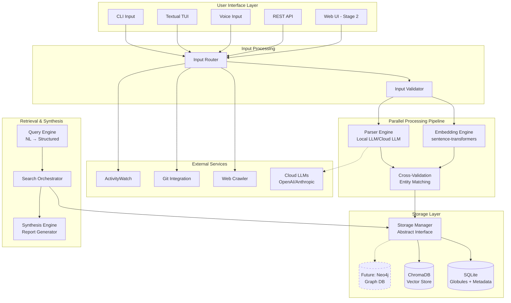

# High-Level Design Document: Globule

> **Document Suite Status**: ~~[[Project-Vision]]~~ | ~~[[Elevator-Pitch]]~~ | ~~[[Requirements]]~~ | ~~[[Non-Functional-Requirements]]~~ | ~~[[User-Flows-and-Mockups]]~~ | **HIGH-LEVEL DESIGN** | [[Low-Level-Design]] | [[API-Specifications]] | [[Business-Strategy]] | [[Operational-Planning]] | [[Glossary]]

## Cross-References & Dependencies
- **[[Requirements]]**: Core functional requirements that drive this architecture
- **[[Non-Functional-Requirements]]**: Performance, scalability, and reliability constraints
- **[[User-Flows-and-Mockups]]**: UI/UX patterns that inform frontend architecture decisions
- **[[API-Specifications]]**: Detailed endpoint definitions (will expand on the API design outlined here)
- **[[Low-Level-Design]]**: Implementation details for each component described here
- **[[Business-Strategy]]**: Business requirements that influence technical decisions

## Executive Summary
Globule is a universal thought processor and knowledge management system that fundamentally reimagines how humans interact with computers. Unlike traditional note-taking applications that require manual organization, Globule employs an "AI Symbiosis" model where users focus purely on capture while AI handles all organizational complexity. The system is designed as a semantic layer that understands the meaning and connections between all user inputs, eventually evolving into a paradigm where computers understand context, not just commands.

## Design Goals & Principles

- **Capture First, Organize Never**: Users should experience zero friction when capturing thoughts. All organizational work happens automatically in the background through AI processing.

- **Semantic Understanding Over Hierarchical Storage**: Information is connected by meaning through embeddings and entity relationships, not by folder structures or manual tags.

- **Progressive Enhancement Architecture**: Start with a simple, valuable MVP that can evolve into a semantic OS layer without architectural rewrites. Each stage adds capabilities without modifying lower layers.

- **Privacy-First, Hybrid-by-Choice**: All data and processing happens locally by default. Cloud features are explicit opt-in with clear privacy implications explained to users.

- **Modular Processing Pipeline**: Every component (input handlers, parsers, storage backends, output formatters) is pluggable, allowing domain-specific extensions without core modifications.

## System Overview
Globule operates as a multi-stage processing pipeline that transforms chaotic human input into structured, queryable knowledge. Users interact through various input methods (CLI, TUI, voice, API) to capture thoughts in their natural form. These inputs flow through parallel processing engines that extract both semantic meaning (via embeddings) and structured data (via LLM parsing). The processed information is stored in a hybrid database system optimized for both semantic similarity search and structured queries. A synthesis engine combines retrieved information to generate insights, reports, and answers to natural language questions.

The architecture follows a "rocket trajectory" development strategy where each stage (Ollie → Kickflip → Tre Flip → 360) adds capabilities while maintaining backward compatibility. The MVP focuses on text capture and semantic search, establishing the foundational patterns that will eventually support multimodal input, passive monitoring, and OS-level integration.

## Tech Stack Decision Matrix

| Layer            | Technology Choice | Justification |
|------------------|-------------------|---------------|
| Frontend         | Textual (TUI) → Web UI | Textual is async-native, essential for responsive UI during AI processing. Web UI added in Stage 2 for broader accessibility |
| Backend/API      | Python AsyncIO + FastAPI | AsyncIO handles concurrent I/O efficiently. FastAPI provides modern, type-safe API development with automatic documentation |
| Database         | SQLite + ChromaDB | SQLite for structured data with JSON columns (future graph migration path). ChromaDB for vector storage with local persistence |
| Authentication   | Local-first (no auth) → JWT | MVP requires no auth. Cloud features in Stage 2 will use JWT with refresh tokens |
| File Storage     | Local filesystem → S3-compatible | JSON files on disk for portability. Optional cloud sync uses S3-compatible storage with encryption |
| Caching          | In-memory → Redis | Python dict caching for MVP. Redis added when scaling beyond single instance |
| Hosting/Deploy   | Local executable → Docker | Packaged Python app initially. Docker containers for consistent deployment across platforms |
| Monitoring       | Python logging → OpenTelemetry | Standard library logging for MVP. OpenTelemetry for distributed tracing in later stages |

## Architecture Components

### Frontend Architecture
- **Framework & Structure**: Textual TUI with CSS-like styling, event-driven architecture. Web UI (Stage 2) uses React with real-time WebSocket updates
- **Key Components**: Input capture widget, semantic search interface, report viewer, configuration panel
- **Client-Side Logic**: Minimal processing - input validation, syntax highlighting, real-time search suggestions
- **Performance Considerations**: Async rendering prevents UI freezing during AI operations. Virtualized scrolling for large result sets

### Backend Architecture
- **API Design**: RESTful for CRUD operations, WebSocket for real-time updates, GraphQL considered for Stage 3 complex queries
- **Service Layer**: 
  - Input Router: Detects input type and routes to appropriate processor
  - Processing Pipeline: Parallel embedding + parsing with cross-validation
  - Query Engine: Natural language to structured query translation
  - Synthesis Engine: Multi-globule narrative generation
- **Data Access**: Abstract StorageManager interface allows backend swapping. Initial SQLite implementation with prepared statements
- **Background Jobs**: ProcessPoolExecutor for CPU-bound AI tasks, AsyncIO tasks for I/O operations

### Data Architecture
- **Database Schema**: 
  - Globules table: id, content, created_at, type, source, metadata (JSON)
  - Vectors stored in ChromaDB with globule_id reference
  - Future: graph relationships table for explicit links
- **Data Flow**: Input → Parallel Processing (Embedding + Parsing) → Cross-validation → Storage → Retrieval → Synthesis
- **Caching Strategy**: 
  - Embedding cache for repeated content
  - Query result cache with semantic similarity keys
  - LLM response cache for common prompts
- **Data Validation**: Input sanitization, schema validation via Pydantic, entity extraction verification

### External Integrations
- **Third-Party APIs**: 
  - OpenAI/Anthropic/Google APIs for cloud LLM features (opt-in)
  - Git APIs for code repository integration
  - ActivityWatch for passive activity monitoring
- **Webhooks**: Inbound webhooks for external tool integration (IFTTT, Zapier)
- **File Processing**: 
  - URL crawler with BeautifulSoup
  - Image processing with CLIP embeddings
  - Document parsing with pypdf, python-docx
- **Email/Notifications**: Local system notifications, optional email reports via SMTP

## Security & Compliance
- **Authentication Flow**: No auth for local usage. OAuth2 flow for cloud features with secure token storage
- **Authorization**: Role-based access for shared workspaces (future). Local user has full access
- **Data Protection**: 
  - SQLite encryption via sqlcipher
  - At-rest encryption for all files
  - TLS for any network communication
  - No telemetry without explicit consent
- **API Security**: Rate limiting via slowapi, input size limits, sanitization of all LLM inputs

## Performance & Scalability
- **Expected Load**: 
  - MVP: Single user, ~100 globules/day, ~10k total
  - Stage 2: Single user, ~1000 globules/day, ~100k total
  - Stage 3: Multi-user workspaces, millions of globules
- **Scaling Strategy**: 
  - Vertical scaling for single-user (more RAM for larger models)
  - Horizontal scaling via read replicas for shared workspaces
  - Sharding by user_id for multi-tenant scenarios
- **Bottlenecks**: 
  - LLM inference speed (mitigate with caching and batch processing)
  - Embedding generation (mitigate with GPU acceleration)
  - Vector search at scale (mitigate with approximate algorithms)
- **Caching Strategy**: 
  - Application: LRU cache for embeddings and LLM responses
  - Database: Query result caching in Redis
  - CDN: Static asset caching for web UI

## System Architecture Diagram

## Data Flow Scenarios

### Primary User Journey
Example: Valet capturing and retrieving incident information
1. **User Input**: Voice command "Mr Jones arrived with damaged fender already there"
2. **Frontend Processing**: Voice converted to text, sent to Input Router
3. **API Request**: POST /globule with content and type="voice"
4. **Backend Processing**: 
   - Parallel: Generate embedding vector (384-dim)
   - Parallel: LLM extracts {customer: "mr_jones", event: "arrival", issue: "pre_existing_damage"}
5. **Data Operations**: 
   - Store globule in SQLite with extracted metadata
   - Store embedding in ChromaDB
   - Cross-reference entities for validation
6. **Response**: Confirmation with globule ID and extracted entities

### Background Processing Flow
Example: End-of-day report generation
1. **Trigger**: User requests "daily report" or scheduled time reached
2. **Queue/Job**: Report generation job dispatched to ProcessPoolExecutor
3. **Processing**: 
   - Query all globules from today
   - Semantic clustering of related events
   - LLM synthesis of narratives
   - Template rendering with extracted metrics
4. **Completion**: Report displayed in TUI, optionally saved as markdown file

## Deployment & Infrastructure
- **Environment Strategy**: 
  - Development: SQLite file-based, small local models
  - Production: SQLite with WAL mode, full-size models, optional PostgreSQL for multi-user
- **CI/CD Pipeline**: 
  - GitHub Actions for automated testing
  - Build → Unit tests → Integration tests → Security scan → Package
  - PyInstaller for standalone executables
- **Infrastructure**: 
  - MVP: Local machine deployment only
  - Stage 2: Docker containers for consistent deployment
  - Stage 3: Kubernetes for multi-tenant cloud deployment
- **Monitoring**: 
  - Python logging with rotating file handlers
  - Prometheus metrics for performance tracking
  - Sentry for error tracking in cloud deployments
  - Custom analytics for usage patterns (privacy-preserving)

## Risk Assessment
- **Technical Risks**: 
  - LLM parsing accuracy: Mitigate with few-shot examples and human-in-the-loop feedback
  - Embedding model changes: Abstract interface allows model swapping without data migration
- **Scalability Risks**: 
  - Vector search performance degradation: Implement HNSW indexing and pagination
  - Storage growth: Implement age-based archival and compression
- **Security Risks**: 
  - Local data exposure: Encrypt database and implement OS-level access controls
  - Prompt injection: Sanitize all user input before LLM processing
- **Operational Risks**: 
  - Data loss: Automatic backups and optional cloud sync
  - Model availability: Cache models locally, fallback to simpler models
- **Dependency Risks**: 
  - ChromaDB changes: Abstract vector store interface for easy migration
  - Python ecosystem: Pin all dependencies, thorough testing before updates

## Open Architectural Decisions

### ⚠️ DECISIONS NEEDED
- Graph database selection for Stage 3: Neo4j vs. ArangoDB vs. extended SQLite
- Real-time collaboration protocol: CRDTs vs. Operational Transformation
- Federated learning framework: FedGraph vs. Flower vs. custom implementation

### 🔄 UNDER CONSIDERATION  
- WebAssembly for browser-based local processing
- Rust rewrite of performance-critical paths
- Plugin sandboxing mechanism for untrusted extensions

### 📝 REQUIRES SPECIFICATION
- Exact schema for domain-specific parsers
- Versioning strategy for globule format changes
- Backup and restore procedures
- Privacy policy for cloud features

## Future Architectural Evolution
- **Phase 2 Features**: 
  - Multimodal input processing (images, URLs, code)
  - Real-time collaboration with conflict resolution
  - Plugin marketplace with sandboxed execution
- **Technology Evolution**: 
  - Migration from ChromaDB to Milvus for production scale
  - GraphQL API for complex query patterns
  - WebAssembly modules for browser-local processing
- **Scaling Roadmap**: 
  - Single-user local (MVP) → Single-user hybrid → Multi-user workspaces → Federated network
  - Sharding strategy when exceeding 1M globules per user
  - Read replicas for popular shared knowledge bases
- **Technical Debt**: 
  - Refactor Input Router to strategy pattern for cleaner extension
  - Extract LLM interaction into dedicated service
  - Implement proper event sourcing for globule modifications