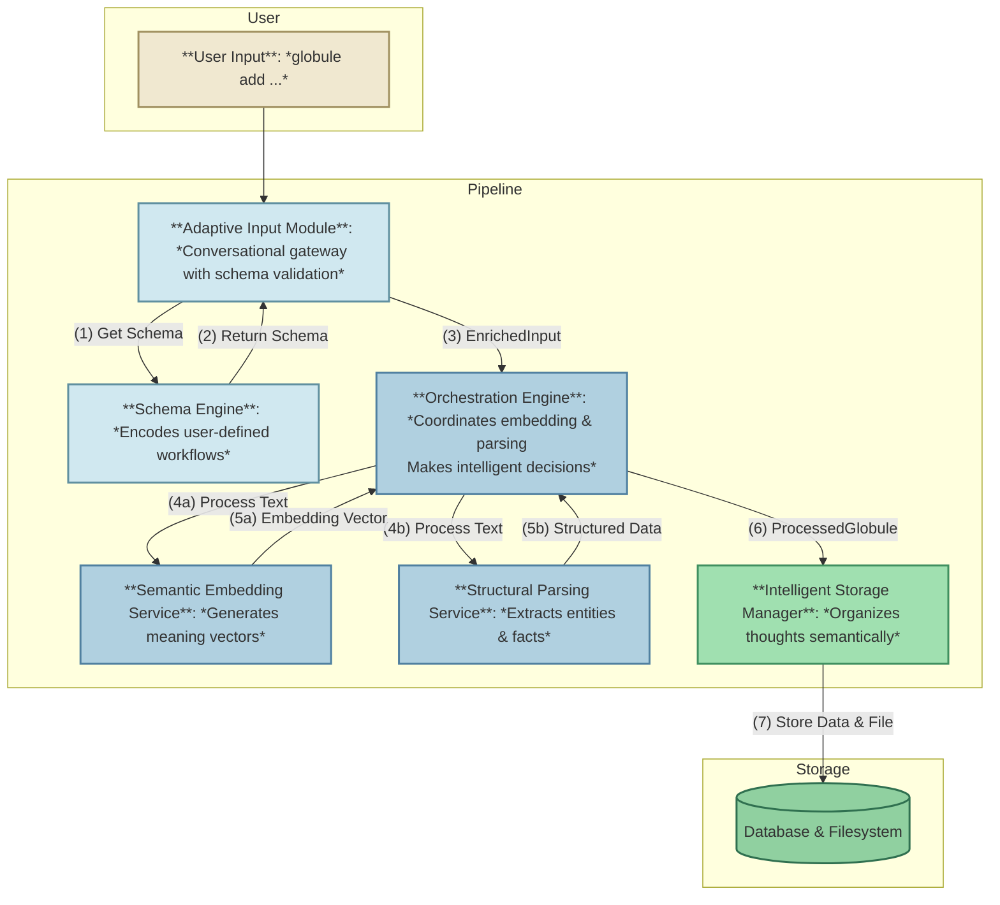
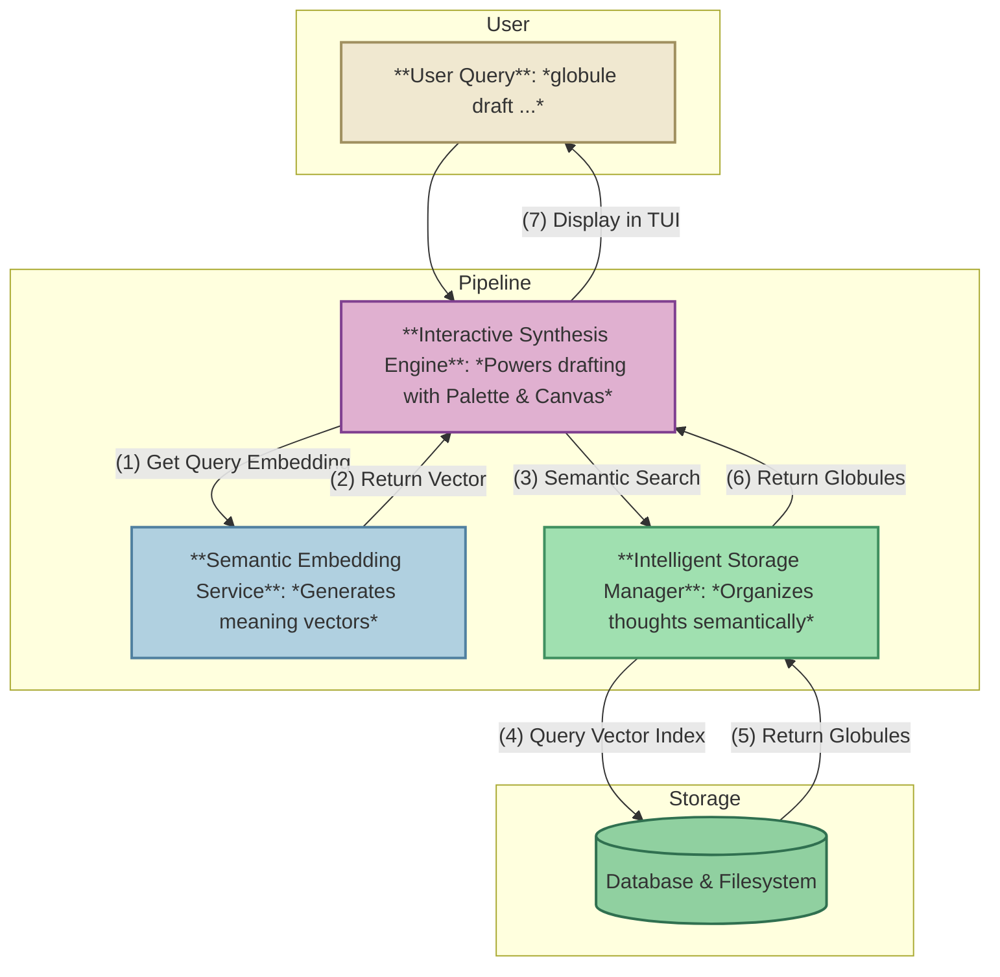

# Component Interaction Flows

_Version: 1.2_
_Status: Draft_

This document provides a step-by-step description of how the core components of Globule interact during the primary user flows. It illustrates the dynamic behavior of the system, complementing the static diagrams in the other architecture documents.

## Flow 1: The Ingestion Pipeline

This flow is triggered when a user adds a new "globule" to the system (e.g., `globule add "Note to self: research CRDTs for the real-time collaboration feature."`).

**Step 1: Entry & Initial Validation**

- **Component:** `Adaptive Input Module`
- **Input:** The raw text string from the user.
- **Action:**
  1.  It consults the **`Schema Engine`** to determine the input's type, passing the text to the engine's detection function.
  2.  The `Schema Engine` checks its library of triggers. In this case, no specific trigger matches, so it returns the default `free_text` schema.
  3.  If the schema required more information (e.g., a `link_curation` schema needing context), the `Adaptive Input Module` would prompt the user. Here, it does not.
- **Output:** It packages the raw text and the determined schema ID (`free_text`) into an `EnrichedInput` object and passes it to the central coordinator.

**Step 2: The Conductor Orchestrates Intelligence**

- **Component:** `Orchestration Engine`
- **Input:** The `EnrichedInput` object.
- **Action:** This is the heart of the processing. It initiates two tasks in parallel:
  1.  It calls the **`Semantic Embedding Service`**, passing it the raw text. The service returns a high-dimensional vector embedding.
  2.  It calls the **`Structural Parsing Service`**, passing it the raw text and the schema hint (`free_text`). The service uses an LLM to extract entities (like "CRDTs", "real-time collaboration"), categories (e.g., "technical-research"), and other metadata.
- **Output:** Once both tasks are complete, the `Orchestration Engine` combines the original text, the schema ID, the new embedding vector, and the structured data into a single, comprehensive `ProcessedGlobule` object.

**Step 3: Intelligent Persistence**

- **Component:** `Intelligent Storage Manager`
- **Input:** The `ProcessedGlobule` object from the `Orchestration Engine`.
- **Action:** It performs two critical storage operations:
  1.  **Database Storage:** It saves the structured parts of the globule��the text, entities, creation date, and the embedding vector—into the SQLite database. This makes the data queryable.
  2.  **Semantic Filesystem Storage:** It uses the information in the `ProcessedGlobule` to generate a meaningful path and filename (e.g., `.../technical-research/crdt-real-time-collaboration.md`) and writes the original note text into it.
- **Output:** The process is complete. The user's thought is now stored, indexed, and semantically organized.

---

## Flow 2: The Synthesis & Retrieval Flow

This flow is initiated when the user wants to create something new from their existing thoughts (e.g., `globule draft "real-time features"`).

**Step 1: Query & Retrieval**

- **Component:** `Interactive Synthesis Engine`
- **Input:** The user's query string, "real-time features".
- **Action:**
  1.  It first needs to understand the _meaning_ of the query, so it calls the **`Semantic Embedding Service`** to get a vector embedding for "real-time features".
  2.  It then passes this query vector to the **`Intelligent Storage Manager`**'s semantic search function.
- **Output:** The `Intelligent Storage Manager` queries its vector index to find the most similar globules and returns a list of `Globule` objects.

**Step 2: Display and Interaction**

- **Component:** `Interactive Synthesis Engine`
- **Input:** The list of relevant `Globule` objects.
- **Action:**
  1.  It populates its "Palette" pane with these globules, perhaps clustering them for clarity.
  2.  The user interacts with the TUI, selecting globules, writing on the "Canvas", and potentially triggering new actions.
  3.  If the user wants to "explore" a specific globule, the engine might repeat Step 1 using that globule's embedding to find even more related thoughts ("Progressive Discovery").
- **Output:** A finished, polished document created by the user.

---

## Supporting Roles of Foundational Components

The **`Configuration System`** and **`Schema Engine`** are not typically in the direct data pipeline but are constantly consulted by all other components.

- The `Orchestration Engine` asks the `Configuration System` which LLM model to use.
- The `Storage Manager` asks the `Configuration System` for the database path.
- The `Adaptive Input Module` asks the `Schema Engine` to validate an input.
- The `Structural Parsing Service` might ask the `Schema Engine` for the detailed field list of a specific schema to construct a better prompt.

This makes them foundational dependencies for the entire system, providing the essential "rules of the road" for all other components.
