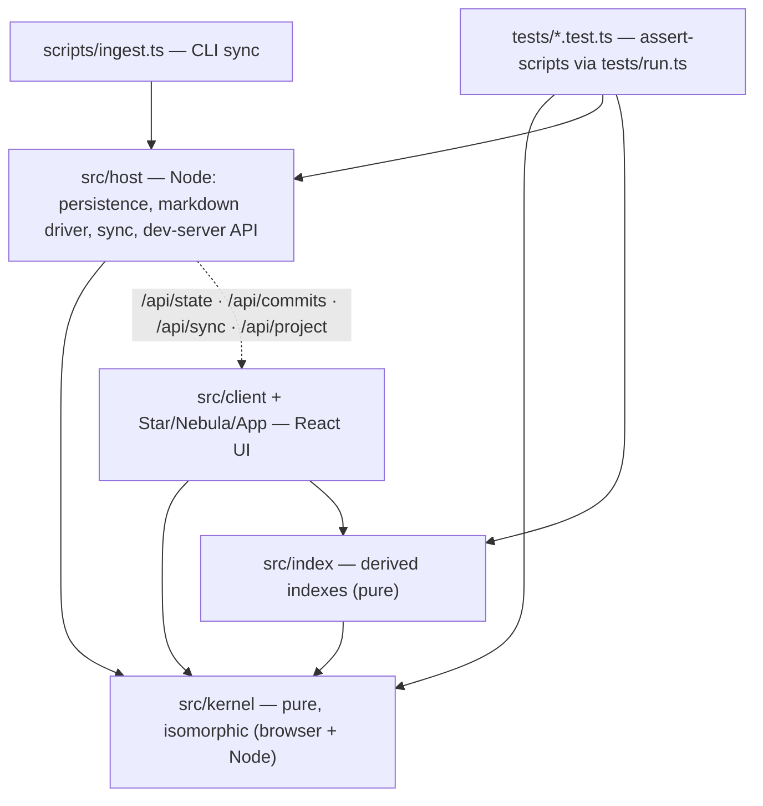
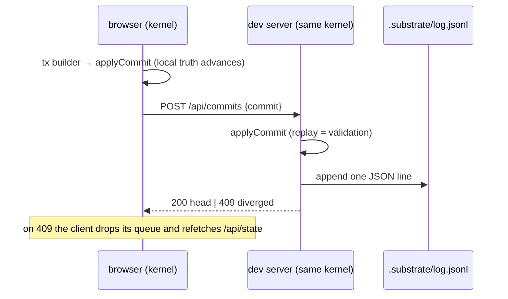

# Substrate — Architecture

A local-first spatial workspace for text, built on a small immutable-history
kernel. The design is specified in [wiki/](wiki/README.md); this document is
the engineer's map of the code that implements it. Current milestone status
lives in [wiki/plan.md](wiki/plan.md).

## 1. What it is, in one paragraph

Truth is a graph of six kinds of object: a **chunk** is a continuing identity;
a **revision** is an immutable historical state of one chunk; a **blob** is an
immutable content-addressed payload; an **occurrence** places a chunk inside a
container (the same chunk can appear in many places, pinned or live, watched
or not); a **derivation** records ancestry; a **link** records an explicit
connection. Every mutation is one **operation** producing one **commit**
appended to a log, and everything that wants to become truth but is not yet —
model output, upstream source changes, reconciliations, merges — is a
**proposal**, inert until accepted. The UI (a nebula of stars over a focused
document surface) is a view; views never mutate truth.

## 2. Module map



| Area | Files | Responsibility |
|---|---|---|
| Kernel types | `kernel/types.ts` | The shared vocabulary; `Facts` (explicit state deltas) and `Commit` |
| State | `kernel/state.ts` | Materialized maps; `applyCommit` validates invariants then folds atomically; `renderChunk` |
| Transactions | `kernel/tx.ts` | One operation = one commit: create/revise/place/move/sever, copy/reference/transclude, promote (extract, copy, span-anchor), propose/accept/reject, tombstone/redact, watched-source scanning |
| Pipeline | `kernel/select.ts` | select → reduce (structured, provenance-keeping) → generate behind a `Completer` seam; output is always a proposal |
| Decomposition | `kernel/decompose.ts` | Versioned methods (`md/blocks@1`, `sent/icu@1`, `word/icu@1`) producing span addresses, never chunks |
| Merge | `kernel/merge.ts` | Line-LCS diff3; two-parent merge proposals |
| Support | `kernel/hash.ts` `fractional.ts` `ids.ts` `serialize.ts` | SHA-256 content addresses; string fractional indexing; opaque ids; state ↔ JSON |
| Persistence | `host/store-fs.ts` | `.substrate/` workspace: append-only `log.jsonl`, content-addressed `blobs/`, atomic `snapshot.json`, single-writer lock |
| Driver | `host/markdown.ts` `similarity.ts` | Import/project/reconcile markdown with sidecars; fast-forward external-only edits; reconciliation proposals on two-sided change |
| Sync + API | `host/sync.ts` `host/api.ts` | Folder sweep; Vite dev-server endpoints |
| Indexes | `index/indexes.ts` | Term, interning, and sentence-echo indexes; ranked search; first-seen as a query result |
| UI | `App.tsx` `Nebula.tsx` `Star.tsx` `client/*` | Nebula (search, provenance lens, proposal badges) and Star (blocks, promotion toolbar, proposals, deep-fates panel, watched transclusion) |

The kernel depends on nothing and runs unchanged in both the browser and
Node. Everything else is a leaf behind a seam.

## 3. The commit protocol



External edits flow the other way: `/api/sync` sweeps the content folders,
imports new files, fast-forwards files only the filesystem changed, raises
reconciliation proposals where both sides moved, and scans watched
transclusions for source updates.

## 4. Persistence layout

```text
.substrate/
  log.jsonl      one commit per line; the authoritative history
  blobs/ab/abc…  content-addressed payloads {mediaType, text}
  snapshot.json  { coveredCommits, state } — atomic temp+rename; every 50 commits
  sidecars/…     markdown round-trip memory: {docChunkId, blocks[], file hashes}
  lock           single-writer pid lock
```

Replay never needs `blobs/` (commits carry their blobs); the directory is the
canonical payload store for integrity and future compaction. Reload = snapshot
+ log tail; a torn final line is truncated as a crash artifact.

## 5. Guarantees the tests pin

- Revisions are immutable; a refused commit leaves state untouched.
- Containment (including transclusion) admits no cycle.
- Arrangement changes never create revisions.
- Extraction preserves rendered text exactly; promotion happens only on
  commitment, and only the asked-for promotion happens.
- Copy shares blob storage but never identity or edit authority.
- Model output, source updates, suggested edits, reconciliations, and merges
  apply only through accepted proposals; stale proposals supersede rather
  than apply; rejections are kept.
- Accepted generation records the model actor as revision creator and the
  accepting actor on the operation.
- Redacted and tombstoned material drops out of renders, selection, search,
  echoes, and first-seen — first-seen reflows to the next visible source.
- A reloaded workspace is indistinguishable from the one that wrote the log.

## 6. Running

```text
npm run dev      # serves the UI; the repo's own wiki is the demo corpus
npm test         # tests/run.ts — kernel invariants, store, driver, indexes, merge
npm run ingest   # CLI sync: npm run ingest -- <folder> [contentDir ...]
npx tsx tests/live-loop.ts   # end-to-end replay check against a running dev server
```

## 7. Seams waiting for their next tenant

`Completer` (real model driver), `WorkspaceStore` (SQLite backend), external
knowledge cache (M8), collaboration transport over the multi-parent commit
DAG, embeddings behind `SemanticState`. Each is designed in the wiki; none
blocks the others.
