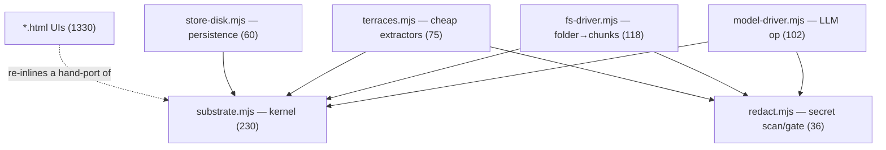
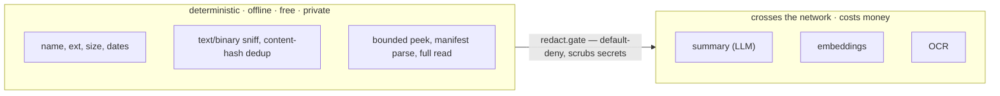

# Substrate — Architecture

A content-addressed tree store for text, with an LLM call as a first-class operation.
Written in dependency-free Node ESM (`.mjs`). ~621 lines of `src/`. This doc is for an
engineer picking it up cold: the data model, the module boundaries, the control flow, the
trust boundary, and an honest punch-list for improving it and cutting lines.

## 1. What it is, in one paragraph

The unit of data is a **chunk**: one node of a document or conversation (a paragraph, a
list item, a heading and its section, or a whole file). Chunks form a tree; the tree is the
markdown/filesystem structure, parsed. On top of that tree there are exactly three
operations — **select** (gather a subset), **reduce** (flatten a subset into a bounded
context string), **generate** (send that context to an LLM and parse the reply back into
chunks). Everything else (search, drag-reorder, fork, ingest a folder, ask a model to
expand a note) is one of those three, or plain tree mutation. It is deliberately three
things fused into one type: a filesystem, a git-style object store, and an LLM call.

## 2. Data model

Every node is a `Chunk`. Fields group into four concerns with different mutability rules —
this is the one idea the whole thing rests on.

| Field | Zone | Mutability | Meaning |
|---|---|---|---|
| `id` | identity | immutable | minted once; survives edits |
| `causal_seq` | identity | immutable | logical clock at birth; the true order |
| `kind` | content | set at parse | `message` / `heading_section` / `paragraph` / `list` / `list_item` / `file` / `project` / `directory` |
| `text` | content | versioned | the node's text; `null` for containers |
| `content_hash` | content | derived | leaf: `hash(kind+text)`; container: `merkle(children)` |
| `parent_id` | view | mutable | tree edge |
| `order_key` | view | mutable | fractional index among siblings (curated order) |
| `origin` | provenance | immutable | `{actor (human/model), at, source_id}` |
| `derived_from` | provenance | set-once | `{id, op}` on fork/generate |
| `edits` | provenance | append-only | `[{at, actor, from, to}]` |
| `binding` | driver | set-once | absolute source path |
| `meta` | driver | set-once | `{ext, kind, size, mtime, secret, redactions}` |
| `context` | generate | set-once | chunk ids this reply was assembled from |

Invariants that matter:

- **`id` is stable for the chunk's life.** Editing `text` changes `content_hash`, never
  `id`. (inode vs. bytes.) Inbound references survive edits.
- **Two orderings coexist.** `causal_seq` = the true creation order (audit/provenance);
  `order_key` = the user's curated order (display/context assembly). They diverge on
  reorder; both are kept.
- **`content_hash` is a Merkle hash.** Leaf = `hash(kind + text)`; container =
  `hash(kind + concat(child hashes))`. So a subtree's hash changes iff its content changed —
  cheap change-detection, and integrity verification on load.
- **`edits` and provenance are append-only.** You can always answer "who authored/changed
  this," including human vs. model.

## 3. Modules



| File | LOC | Responsibility | Public API |
|---|---|---|---|
| `src/substrate.mjs` | 230 | The kernel: chunk factory, tree store, hashing, the operations. No I/O, no deps. | `Store`, `parse`, `makeChunk`, `fnv1a`, `keyBetween`, `syncSeq`, `select`, `reduce`, `edit`, `rearrange`, `fork`, `reingest`, `search` |
| `src/redact.mjs` | 36 | Content secret detection + the enforcement gate. | `scan(text)→{safe,hits,redacted}`, `gate(content,mode)→{allowed,content,hits}` |
| `src/store-disk.mjs` | 60 | Persist/reload the store; optional AES-256-GCM at rest. | `saveStore(store,file,{passphrase})`, `loadStore(file,{passphrase})` |
| `src/terraces.mjs` | 75 | Deterministic per-file extractors (role, text-sniff, content-hash, peek, manifest). | `t_role`, `t_isText`, `t_contentHash`, `t_peek`, `t_manifest` |
| `src/fs-driver.mjs` | 118 | Walk a folder → chunks. Project-aware (a repo = one chunk), default-deny on reading file bodies. | `ingestDir(root, opts)→{store, rootId, summary}` |
| `src/model-driver.mjs` | 102 | The `generate` operation + the LLM seam (any OpenAI-compatible endpoint). | `openaiCompatible`, `drivers`, `gather`, `assemble`, `generate` |

The kernel depends on nothing. Every other module depends only on the kernel (and `redact`).
That acyclic shape is the point: the hard part (the data model + invariants) is written once
and everything else is a leaf that plugs in.

## 4. Control flow: the three operations

`select` and `reduce` are pure functions over the store. `generate` is the only one that
does I/O. Here is the full path when you ask a model to think about one chunk:

```mermaid
sequenceDiagram
  participant App as caller
  participant K as kernel (store)
  participant G as redact.gate
  participant M as model driver
  App->>K: SELECT — gather(store, targetId)
  Note right of K: target + ancestors + siblings
  K-->>App: chunks[]
  App->>K: REDUCE — assemble(store, chunks)
  K-->>App: {context, manifest, tokens}
  App->>G: scan(context) — trust boundary
  alt secret found
    G-->>App: redact (or throw if strict)
  end
  App->>M: complete(messages) — only network call
  M-->>App: markdown reply
  App->>K: parse(reply) into new subtree
  Note over K: set derived_from + context; rehash spine
```

The reply is *parsed into chunks*, not stored as a blob of text — so a model's answer is
the same data type as everything else, addressable and re-selectable. The model has no tool
access; it only returns text.

## 5. Trust boundary

The extractors are tiered by cost, and the cost line is also the privacy line.



Two enforcement points, both in code:
- `fs-driver` is **default-deny**: it reads zero file bodies unless a policy explicitly opts
  in an extension/path (`ingestDir(root, {content:{readPeek, allowExt, allowUnder}})`).
- `redact.gate` scrubs credentials (AWS/OpenAI/etc. keys, private keys, `SECRET=` lines)
  before content is stored, and again before any content is sent to a model.

## 6. Completion state

| Area | State |
|---|---|
| Kernel (chunk, tree, hashing, ops) | done, tested |
| Persistence (`store-disk`, encrypted) | done, tested |
| Drivers: markdown, filesystem, model | done |
| Extractors (terraces T1–T8) + secret gate | done |
| Lexical search | done |
| Binding (chunk→path) | data exists; nothing acts on it |
| Semantic index / embeddings / clustering | not built |
| Content sub-drivers (pdf/docx/code parse) | not built |
| UI ↔ live model (browser artifacts) | replays captured output; live call is Node-only |

## 7. How to improve it / cut lines

Ordered by payoff. Items 1–4 are the ones I'd do first.

1. **Kill the triplicated kernel (~300 lines).** `class Store` + `parse` + hashing exist
   three times: canonically in `substrate.mjs` and hand-re-inlined into `substrate-demo.html`
   and `substrate-home.html` (artifacts can't `import`). Add a one-file build step (esbuild)
   that inlines `substrate.mjs` into the HTML at publish; or, for the eventual desktop app,
   have the UI import the module and the copies disappear. This is the biggest source of both
   line count and drift risk.

2. **One explicit `Chunk` type.** Fields are currently bolted on after construction
   (`c.binding`, `c.meta`, `c.derived_from`, `c.context`). Define the type once (TS interface
   or a JSDoc `@typedef`). This is a prerequisite for a Rust port (it becomes the struct) and
   lets you delete scattered `?? null` / `if (c.x)` defensive checks.

3. **Unify hashing.** There are three hash notions today: leaf `content_hash =
   fnv1a(kind+'|'+text)`, container Merkle, and a separate `fnv1a(text)` blob key in
   `store-disk`, plus `t_contentHash` over file bytes. Collapse to one `hash(bytes)` primitive,
   reuse the leaf hash as the blob key (so `store-disk` stops recomputing), Merkle for
   containers. Also decide on strength: `fnv1a` is 32-bit and non-cryptographic — fine for
   change-detection, collision-prone as a content address at machine scale. `node:crypto` is
   already imported by `store-disk`; switch content-addressing to truncated SHA-256 or keep
   fnv1a only for the Merkle/change-detection role. Pick one story.

4. **Fix the order key.** `keyBetween` is float-midpoint over `parseFloat` — precision runs
   out after ~50 inserts between the same two siblings, silently breaking ordering. Replace
   with string fractional indexing (base-62 midpoint, ~15 lines). Small change, removes a
   latent correctness bug.

5. **Deduplicate the fs walk (~15 lines).** `summarize()` and `walk()` re-implement the same
   directory traversal + SKIP logic. Extract one `walkDir` generator; both call it.

6. **Shared test fixtures (~40 lines).** The 7 demo/test scripts each re-declare the same
   sample markdown. Move it to `fixtures.mjs`.

7. **Move the send-gate to the seam (security, not LOC).** `gate('send')` runs inside
   `generate()`. Push it into `openaiCompatible.complete` so no future code path can call a
   model without passing the redactor. Same lines, stronger guarantee.

Non-LOC, capability gaps worth naming: the **index** is only lexical (no embeddings/clustering —
this is the thin limb); **binding** is inert (no write-back driver); `saveStore` rewrites the
whole store on every save (O(n) — fine now, wants an append-log or SQLite at scale);
prompt-injection mitigation is partial (the `⟦…⟧` fence characters aren't stripped from ingested
content, so a payload can forge an early `⟦END⟧`).

## 8. Notes for a Rust port

The seams are already where the language boundary should fall:

- **Kernel** is pure data-structure code — the natural first thing to port, and the highest-value
  (correctness + speed). The four-zone mutability model maps cleanly: immutable fields, an
  append-only `Vec` for `edits`, and the view fields (`parent_id`, `order_key`) as the only
  mutable state. Compile to WASM and the browser UI can use the same core instead of a re-port
  (kills item 1 for free).
- **`fs-driver`** in Rust would be materially faster on a full-machine scan (it's I/O + syscalls).
- **`store-disk`** crypto → `aes-gcm` + `scrypt` crates; the envelope format is already defined.
- **`model-driver`** stays behind its `complete(messages) -> String` seam wherever it lives.
- The clean FFI/Tauri boundary is: `ModelDriver.complete`, `saveStore`/`loadStore`, and
  `ingestDir`. Keep those signatures stable and either side can be swapped independently.
