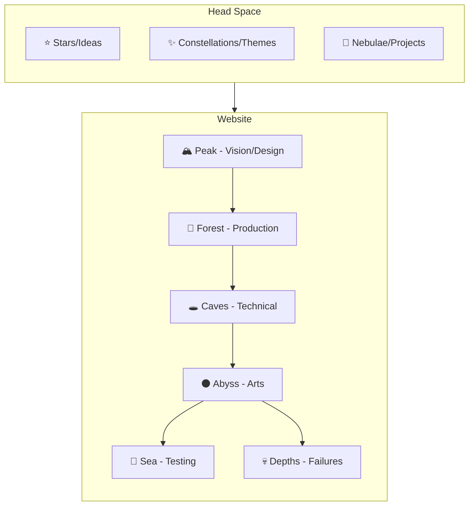
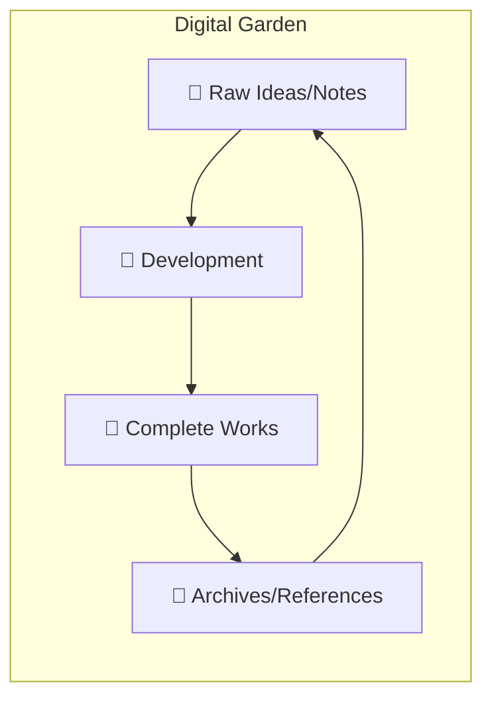
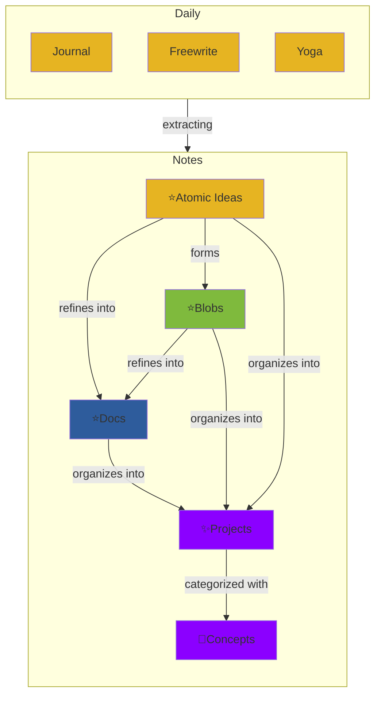

## Structure

### Public Facing

The circular nature (depths reconnecting to stars) nicely captures how post-mortems feed back into new ideas.

### Internal Development Framework

### 1. Root Structure

knowledge-base/
├── 🌱_seeds/
│   ├── dreams/
│   ├── daily_notes/
│   └── quick_thoughts/
├── 🌿_growing/
│   ├── website_dev/
│   ├── sol_eremus/
│   ├── philosophy/
│   └── technical/
├── 🌳_mature/
│   ├── published/
│   ├── documentation/
│   └── completed_projects/
└── 🍂_compost/
    ├── archives/
    ├── references/
    └── learning/

### 2. Project-Specific Organization

sol_eremus/
├── vision/
│   ├── design_docs/
│   └── research/
├── production/
│   ├── timelines/
│   └── resources/
├── technical/
│   ├── code/
│   └── systems/
├── creative/
│   ├── art/
│   └── narrative/
└── testing/
    ├── feedback/
    └── iterations/

### 3. Note Types 

#### Daily Journal

Type: Seed/Space Object
Structure: Chronological capture
Content:
- Daily events
- Raw thoughts
- Quick captures
- Unrefined ideas

Connection Strategy:
- Minimal direct linking
- Allow unlinked mentions
- Preserve chronological integrity

#### Atomic Idea

Type: Seed/Building Block/Star/Planet
Size: Single concept/idea
Content:
- One clear thought
- Single insight
- Core concept
- Foundational idea

Connection Strategy:
- Highly referenceable
- Many incoming links
- Clear atomic concept

#### Blob

Type: Growing/Space Object
Size: Medium
Style: Personal voice
Content:
- Dev logs
- Critiques
- Reflections
- Explorations

Connection Strategy:
- References dust motes
- Personal perspective
- Casual linking

#### Document

Type: Mature/Documentation/Star
Style: Professional
Content:
- Finished pieces
- Polished work
- Public-ready content
- Technical documentation

Connection Strategy:
- Heavy referencing
- Structured links
- Clear hierarchy

#### Project

Type: Organized Collection
Structure: Project folder
Content:
- Multiple document types
- Assets and resources
- Research materials
- Implementation files

Organization:
├── overview.md
├── documents/
├── blobs/
├── assets/
├── research/
└── diagrams/

#### Topic

Type: Emergent Pattern/Nebula/Cluster of Stars
Structure: Tag-based/Graph
Content:
- Theme collections
- Concept clusters
- Project patterns
- Knowledge maps

Visualization:
- Graph views
- Tag networks
- Theme maps

## Implementation

Now each document/idea could be:

1. A star in the knowledge base
2. A tree in the production forest
3. A cave system in technical
4. An artwork in the abyss
5. A wave in the testing sea
6. A reflection in the depths

