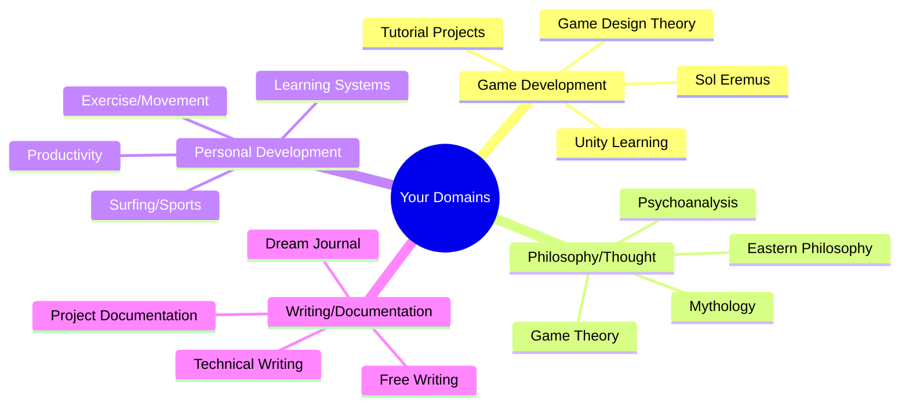

![[Welcome to Internet Edu#^649eee]]

## problems

1) implementing "atomic ideas"?
2) consolidating or keeping track of versions of a document
3) documenting ai chats
4) projects organization
5) directory organization
6) storing assets & references
7) comprehensive templating for document types
8) obsidian native notetaking strategie
9) effective use of tagging and obsidian graph view

## Overview

1. [[Knowledge Organization]]
   - Obsidian
      - Daily notes
      - Dream journal
      - Philosophy notes
      - Project Documentation

2. Unity
   - Game development
   - Prototypes
   - Tutorials
   - Project organization

1. VS Code
   - Code organization
   - Web development
      - [[website outline]]
   - Documentation
   - Git integration

1. Jira/Trello
   - Project management
   - Task tracking
   - Sprint planning
   - Timeline management
     
## Working with Claude

[[Knowledge Management Claude Project]]

