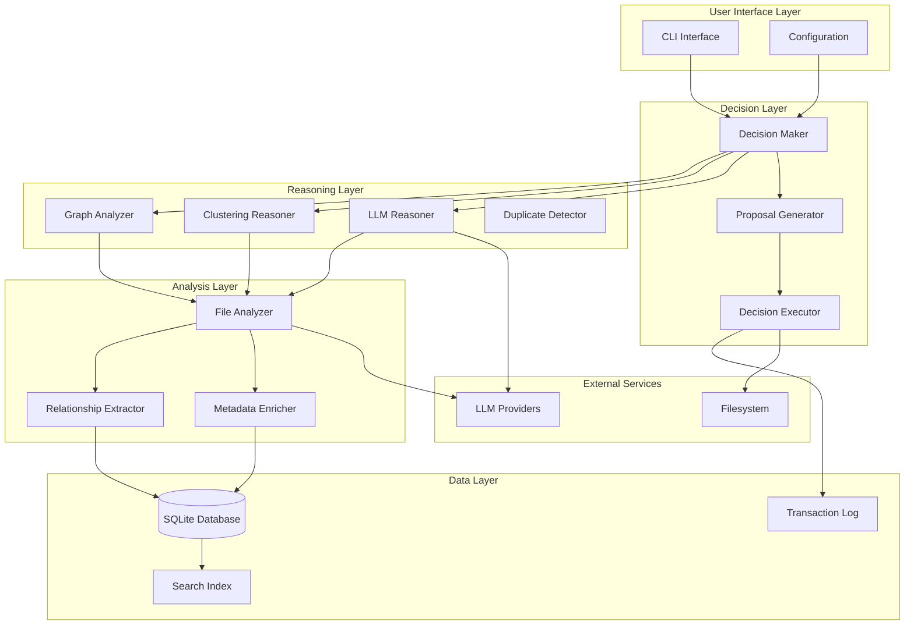

# AI-OS Autonomous Reorganization Engine
## Project Specification & Implementation Guide

**Version:** 1.0  
**Last Updated:** 2025-11-30  
**Project Status:** Foundation Complete, Reorganization Engine Planned

---

## Table of Contents

1. [Executive Summary](#executive-summary)
2. [Project Vision & Goals](#project-vision--goals)
3. [Technical Architecture](#technical-architecture)
4. [Engineering Specifications](#engineering-specifications)
5. [Testing & Quality Assurance](#testing--quality-assurance)
6. [Design & User Experience](#design--user-experience)
7. [Implementation Roadmap](#implementation-roadmap)
8. [Risk Management](#risk-management)
9. [Success Metrics & KPIs](#success-metrics--kpis)
10. [Team Responsibilities](#team-responsibilities)

---

## Executive Summary

### What We're Building

An AI-powered autonomous filesystem reorganization system that can understand, analyze, and restructure computer filesystems using large language models and intelligent reasoning algorithms.

### Current State

**✅ Foundation Complete (v0.1)**
- Multi-provider LLM client abstraction (Gemini, Anthropic, Ollama, Mock)
- Filesystem indexing with AI-generated metadata
- SQLite database for structured metadata storage
- TF-IDF semantic search across indexed files

**🎯 Next Phase (v0.2-v1.0)**
- Enhanced metadata extraction (dependencies, relationships, quality metrics)
- Pluggable reasoning strategies (graph analysis, clustering, LLM-based)
- Safe decision execution with rollback capability
- Human-in-the-loop approval workflow

### Business Value

- **Time Savings:** Automate hours of manual filesystem organization
- **Knowledge Discovery:** Surface hidden relationships between files
- **Technical Debt Reduction:** Identify duplicates, unused files, and reorganization opportunities
- **Developer Productivity:** Maintain clean, semantic project structures automatically

### Key Differentiators

1. **AI-Native:** Uses LLMs to understand semantic meaning, not just filenames
2. **Safety-First:** Transaction logs, rollback, dry-run mode, human approval
3. **Modular:** Pluggable reasoning strategies and analyzers
4. **Provider-Agnostic:** Works with any LLM provider

---

## Project Vision & Goals

### Vision Statement

*"Enable AI agents to autonomously understand and organize computer filesystems with human-level semantic reasoning, operating safely with or without human oversight."*

### Long-Term Goals (Aymarchy Vision)

From `kimi-inception.txt`:
1. Read each file and generate AI descriptions/summaries
2. Build a central index with AI-oriented metadata
3. Organize files into semantic directories
4. Merge similar documents, version control, filesystem cleanup
5. Operate autonomously or with human-in-the-loop

### Short-Term Goals (v0.2)

1. Extract rich metadata beyond simple summaries
2. Implement reasoning algorithms to analyze relationships
3. Generate actionable proposals for reorganization
4. Execute changes safely with full rollback capability

### Success Criteria

- **Accuracy:** 90%+ of proposed changes deemed "correct" by human review
- **Safety:** 100% rollback success rate, zero data loss incidents
- **Usability:** Non-technical users can run with <5 minutes training
- **Performance:** Handle 10,000+ file repositories in <10 minutes

---

## Technical Architecture

### System Overview



### Component Descriptions

#### 1. Analysis Layer
**Responsibility:** Extract rich metadata from files

- **File Analyzer** - Orchestrates metadata extraction
  - Code analysis (imports, functions, classes, dependencies)
  - Document structure analysis
  - Binary file inspection
  - Temporal metadata (creation, modification, access times)
  
- **Relationship Extractor** - Identifies connections between files
  - Import graph construction
  - Cross-file references
  - Dependency mapping
  - Coupling analysis

- **Metadata Enricher** - Enhances data with derived insights
  - Quality metrics (complexity, redundancy)
  - Importance ranking
  - Technical debt markers
  - Dead code detection

#### 2. Reasoning Layer
**Responsibility:** Analyze metadata to generate insights

- **Graph Analyzer** - Network analysis of file relationships
  - Identifies tightly-coupled file clusters
  - Detects orphaned files
  - Maps dependency chains
  - Suggests module boundaries

- **Clustering Reasoner** - Groups similar files
  - Semantic similarity using TF-IDF + embeddings
  - Topic modeling
  - Content-based grouping
  - Identifies natural directory structures

- **LLM Reasoner** - Chain-of-thought analysis
  - Complex decision-making with explanations
  - Conflict resolution between strategies
  - Natural language reasoning traces
  - Human-readable justifications

- **Duplicate Detector** - Finds redundant files
  - Exact duplicates (hash-based)
  - Near-duplicates (fuzzy matching)
  - Versioned files detection
  - Merge candidate identification

#### 3. Decision Layer
**Responsibility:** Convert insights into actionable proposals

- **Decision Maker** - Aggregates reasoning outputs
  - Combines multiple reasoning strategies
  - Resolves conflicts between proposals
  - Confidence scoring
  - Impact assessment

- **Proposal Generator** - Formats decisions for review
  - Human-readable explanations
  - Before/after visualization
  - Risk assessment
  - Batch grouping of related changes

- **Decision Executor** - Safely applies changes
  - Atomic operations (move, merge, split, delete)
  - Transaction logging
  - Rollback capability
  - Backup strategy
  - Dry-run mode

#### 4. Data Layer
**Responsibility:** Persistence and indexing

- **SQLite Database** - Structured metadata storage
- **Search Index** - TF-IDF vectors for semantic search
- **Transaction Log** - Audit trail for all operations

### Data Model

#### Enhanced Database Schema

```sql
-- Core file metadata
CREATE TABLE files (
    id INTEGER PRIMARY KEY,
    path TEXT UNIQUE NOT NULL,
    summary TEXT,
    file_type TEXT,
    size_bytes INTEGER,
    created_at TIMESTAMP,
    modified_at TIMESTAMP,
    last_accessed TIMESTAMP,
    checksum TEXT,  -- SHA256 hash
    extra_metadata TEXT  -- JSON blob
);

-- Code-specific metadata
CREATE TABLE code_metadata (
    file_id INTEGER PRIMARY KEY,
    language TEXT,
    imports TEXT,  -- JSON array
    exports TEXT,  -- JSON array
    functions TEXT,  -- JSON array
    classes TEXT,  -- JSON array
    complexity_score REAL,
    lines_of_code INTEGER,
    FOREIGN KEY (file_id) REFERENCES files(id)
);

-- File relationships
CREATE TABLE file_relationships (
    id INTEGER PRIMARY KEY,
    source_file_id INTEGER,
    target_file_id INTEGER,
    relationship_type TEXT,  -- 'imports', 'references', 'similar_to'
    strength REAL,  -- 0.0 to 1.0
    metadata TEXT,  -- JSON blob
    FOREIGN KEY (source_file_id) REFERENCES files(id),
    FOREIGN KEY (target_file_id) REFERENCES files(id)
);

-- Quality metrics
CREATE TABLE quality_metrics (
    file_id INTEGER PRIMARY KEY,
    importance_score REAL,
    redundancy_score REAL,
    dead_code_probability REAL,
    technical_debt_score REAL,
    last_computed TIMESTAMP,
    FOREIGN KEY (file_id) REFERENCES files(id)
);

-- Decision proposals
CREATE TABLE proposals (
    id INTEGER PRIMARY KEY,
    created_at TIMESTAMP,
    reasoning_strategy TEXT,
    decision_type TEXT,  -- 'move', 'merge', 'split', 'delete', 'rename'
    affected_files TEXT,  -- JSON array of file IDs
    proposed_action TEXT,  -- JSON description
    confidence REAL,
    impact_score REAL,
    status TEXT,  -- 'pending', 'approved', 'rejected', 'executed'
    explanation TEXT
);

-- Transaction log
CREATE TABLE transactions (
    id INTEGER PRIMARY KEY,
    executed_at TIMESTAMP,
    proposal_id INTEGER,
    operations TEXT,  -- JSON array of atomic operations
    status TEXT,  -- 'in_progress', 'completed', 'rolled_back'
    rollback_info TEXT,  -- JSON blob for reverting
    FOREIGN KEY (proposal_id) REFERENCES proposals(id)
);
```

### Technology Stack

| Component | Technology | Rationale |
|-----------|-----------|-----------|
| Language | Python 3.8+ | Rich ecosystem, rapid development |
| Database | SQLite | Embedded, zero-config, ACID compliant |
| LLM Clients | Multi-provider abstraction | Vendor flexibility |
| Search | scikit-learn (TF-IDF) | Lightweight, proven |
| Testing | pytest | Industry standard |
| CLI | argparse / Click | Native, powerful |
| Packaging | setuptools / Poetry | Standard distribution |

### Design Patterns & Principles

#### SOLID Principles Application

**Single Responsibility Principle**
- Each analyzer, reasoner, and executor has one job
- Example: `DuplicateDetector` only finds duplicates, doesn't decide what to do with them

**Open/Closed Principle**
- New reasoning strategies plug in without modifying existing code
- Abstract base classes define contracts

**Liskov Substitution Principle**
- Any `ReasoningStrategy` implementation is interchangeable
- Mock implementations for testing

**Interface Segregation Principle**
- Small, focused interfaces (not god objects)
- Example: `FileReader`, `MetadataExtractor`, `DecisionExecutor` are separate

**Dependency Inversion Principle**
- High-level modules depend on abstractions
- Configuration injection, not hard-coded dependencies

#### Key Design Patterns

- **Strategy Pattern:** Pluggable reasoning algorithms
- **Command Pattern:** Atomic operations for undo/redo
- **Observer Pattern:** Progress callbacks for long operations
- **Factory Pattern:** LLM client instantiation
- **Repository Pattern:** Database abstraction layer

---

## Engineering Specifications

### Module Structure

```
ai-os/
├── src/
│   ├── analyzers/
│   │   ├── __init__.py
│   │   ├── base.py                 # FileAnalyzer base class
│   │   ├── code_analyzer.py        # Code-specific analysis
│   │   ├── relationship_extractor.py
│   │   └── metadata_enricher.py
│   ├── reasoners/
│   │   ├── __init__.py
│   │   ├── base.py                 # ReasoningStrategy base class
│   │   ├── graph_reasoner.py
│   │   ├── clustering_reasoner.py
│   │   ├── llm_reasoner.py
│   │   └── duplicate_detector.py
│   ├── decisions/
│   │   ├── __init__.py
│   │   ├── decision_maker.py
│   │   ├── proposal_generator.py
│   │   └── executor.py
│   ├── core/
│   │   ├── __init__.py
│   │   ├── database.py
│   │   ├── llm_client.py
│   │   ├── search.py
│   │   └── transaction_log.py
│   ├── cli/
│   │   ├── __init__.py
│   │   └── commands.py
│   └── config/
│       ├── __init__.py
│       └── settings.py
├── tests/
│   ├── unit/
│   ├── integration/
│   └── fixtures/
├── docs/
│   ├── PROJECT_SPEC.md             # This file
│   ├── API.md
│   ├── ARCHITECTURE.md
│   └── USER_GUIDE.md
├── indexer.py                       # Legacy, to be refactored
├── search.py                        # Legacy, to be refactored
├── database.py                      # Legacy, to be refactored
├── llm_client.py                    # Move to src/core/
├── requirements.txt
└── setup.py
```

### Interface Specifications

#### FileAnalyzer Base Class

```python
from abc import ABC, abstractmethod
from typing import Dict, Any, List
from pathlib import Path

class FileAnalyzer(ABC):
    """Base class for file analysis strategies."""
    
    @abstractmethod
    def analyze(self, file_path: Path) -> Dict[str, Any]:
        """
        Analyze a file and return metadata.
        
        Args:
            file_path: Absolute path to file
            
        Returns:
            Dictionary containing:
            - summary: str, LLM-generated description
            - file_type: str, detected file type
            - topics: List[str], identified topics
            - action: str, suggested action
            - quality_metrics: Dict[str, float]
            - relationships: List[Dict], connections to other files
        """
        pass
    
    @abstractmethod
    def supports(self, file_path: Path) -> bool:
        """Check if this analyzer supports the given file."""
        pass
```

#### ReasoningStrategy Base Class

```python
from abc import ABC, abstractmethod
from typing import List, Dict, Any

class ReasoningStrategy(ABC):
    """Base class for reasoning strategies."""
    
    @abstractmethod
    def reason(self, file_metadata: List[Dict[str, Any]]) -> List['Decision']:
        """
        Analyze file metadata and generate decisions.
        
        Args:
            file_metadata: List of file metadata dictionaries
            
        Returns:
            List of Decision objects with proposed changes
        """
        pass
    
    @abstractmethod
    def name(self) -> str:
        """Return strategy name for logging/debugging."""
        pass
    
    @abstractmethod
    def confidence(self, decision: 'Decision') -> float:
        """
        Assess confidence in a decision (0.0 to 1.0).
        
        Returns:
            Confidence score
        """
        pass
```

#### Decision Data Class

```python
from dataclasses import dataclass
from typing import List, Dict, Any
from enum import Enum

class DecisionType(Enum):
    MOVE = "move"
    MERGE = "merge"
    SPLIT = "split"
    DELETE = "delete"
    RENAME = "rename"
    CREATE_DIR = "create_directory"
    ARCHIVE = "archive"

@dataclass
class Decision:
    """Represents a proposed filesystem change."""
    
    decision_type: DecisionType
    affected_files: List[str]  # File paths
    proposed_action: Dict[str, Any]  # Type-specific action details
    reasoning: str  # Human-readable explanation
    confidence: float  # 0.0 to 1.0
    impact_score: float  # Estimated impact (files affected, risk)
    reasoning_strategy: str  # Which reasoner generated this
    metadata: Dict[str, Any] = None  # Additional context
    
    def to_json(self) -> Dict[str, Any]:
        """Serialize for storage."""
        pass
    
    def validate(self) -> bool:
        """Check if decision is valid."""
        pass
```

### Configuration Schema

```python
# config/settings.py
from typing import List, Dict, Optional
from pydantic import BaseModel, Field

class LLMConfig(BaseModel):
    provider: str = Field(..., description="gemini|anthropic|ollama|mock")
    model: str = Field(..., description="Model identifier")
    api_key: Optional[str] = Field(None, description="API key if required")
    base_url: Optional[str] = Field(None, description="Custom endpoint")
    max_tokens: int = Field(2000, description="Max tokens per request")
    temperature: float = Field(0.3, description="Sampling temperature")

class AnalyzerConfig(BaseModel):
    enabled_analyzers: List[str] = Field(
        default=["code", "document", "binary"],
        description="Which analyzers to run"
    )
    extract_relationships: bool = Field(True)
    compute_quality_metrics: bool = Field(True)

class ReasonerConfig(BaseModel):
    enabled_reasoners: List[str] = Field(
        default=["graph", "clustering", "duplicates"],
        description="Which reasoning strategies to use"
    )
    llm_reasoning_enabled: bool = Field(False, description="Expensive")
    conflict_resolution: str = Field("vote", description="vote|confidence|manual")

class ExecutionConfig(BaseModel):
    safety_level: str = Field("dry-run", description="dry-run|review|auto")
    create_backup: bool = Field(True)
    require_approval: bool = Field(True)
    batch_size: int = Field(10, description="Operations per transaction")

class ProjectConfig(BaseModel):
    """Root configuration."""
    llm: LLMConfig
    analyzers: AnalyzerConfig
    reasoners: ReasonerConfig
    execution: ExecutionConfig
    database_path: str = Field("ai_os.db")
    ignore_patterns: List[str] = Field(
        default=[".git", "node_modules", "__pycache__", ".venv"]
    )
```

### Error Handling Strategy

**Error Categories:**

1. **User Errors** - Invalid inputs, configuration mistakes
   - Return clear error messages
   - Suggest corrections
   - Don't crash

2. **External Service Errors** - LLM API failures, network issues
   - Retry with exponential backoff
   - Fallback to degraded mode
   - Cache results when possible

3. **Data Errors** - Corrupted files, permission issues
   - Skip problematic files
   - Log for manual review
   - Continue processing

4. **System Errors** - Bugs, unexpected states
   - Rollback changes
   - Preserve state
   - Alert with context

**Error Handling Principles:**
- Fail safely (never lose data)
- Provide actionable error messages
- Log with context (what, when, why, how to fix)
- Separate transient vs permanent failures

---

## Testing & Quality Assurance

### Testing Strategy

#### Testing Pyramid

```
        /\
       /E2E\        10% - End-to-End Tests
      /------\
     /  INT   \     30% - Integration Tests
    /----------\
   /   UNIT     \   60% - Unit Tests
  /--------------\
```

### Test Levels

#### 1. Unit Tests (60% of tests)

**Scope:** Individual functions and classes in isolation

**Tools:** pytest, pytest-mock, pytest-cov

**Coverage Target:** 90%+ for core logic

**Examples:**
```python
# tests/unit/test_graph_reasoner.py
import pytest
from src.reasoners.graph_reasoner import GraphReasoner
from src.decisions.base import Decision, DecisionType

def test_graph_reasoner_identifies_coupled_files():
    """Test that tightly coupled files are grouped together."""
    reasoner = GraphReasoner()
    
    # Mock metadata with clear coupling
    metadata = [
        {"id": 1, "path": "a.py", "imports": ["b.py"]},
        {"id": 2, "path": "b.py", "imports": ["a.py"]},
        {"id": 3, "path": "c.py", "imports": []},
    ]
    
    decisions = reasoner.reason(metadata)
    
    # Should propose moving a.py and b.py to same directory
    move_decisions = [d for d in decisions if d.decision_type == DecisionType.MOVE]
    assert len(move_decisions) >= 1
    assert set(move_decisions[0].affected_files) == {"a.py", "b.py"}

def test_duplicate_detector_finds_exact_matches():
    """Test duplicate detection with identical files."""
    from src.reasoners.duplicate_detector import DuplicateDetector
    
    detector = DuplicateDetector()
    metadata = [
        {"path": "doc1.txt", "checksum": "abc123"},
        {"path": "doc2.txt", "checksum": "abc123"},  # Exact duplicate
        {"path": "doc3.txt", "checksum": "def456"},
    ]
    
    decisions = detector.reason(metadata)
    
    merge_proposals = [d for d in decisions if d.decision_type == DecisionType.MERGE]
    assert len(merge_proposals) == 1
    assert "doc1.txt" in merge_proposals[0].affected_files
    assert "doc2.txt" in merge_proposals[0].affected_files
```

**Unit Test Checklist:**
- [ ] All analyzers test supported file types
- [ ] All reasoners test edge cases (empty input, single file, large datasets)
- [ ] Decision validation catches invalid proposals
- [ ] Executor handles file operation errors gracefully
- [ ] Configuration parsing rejects invalid configs
- [ ] LLM client abstraction works with mock provider

#### 2. Integration Tests (30% of tests)

**Scope:** Multiple components working together

**Tools:** pytest, pytest-integration, temporary filesystems

**Examples:**
```python
# tests/integration/test_analysis_pipeline.py
import pytest
import tempfile
from pathlib import Path
from src.analyzers.code_analyzer import CodeAnalyzer
from src.core.database import Database

def test_code_analyzer_to_database_pipeline():
    """Test full analysis pipeline from file to database."""
    with tempfile.TemporaryDirectory() as tmpdir:
        # Create test file
        test_file = Path(tmpdir) / "test.py"
        test_file.write_text("""
import os
from pathlib import Path

def hello():
    return "world"
""")
        
        # Analyze
        analyzer = CodeAnalyzer(llm_provider="mock")
        metadata = analyzer.analyze(test_file)
        
        # Store in database
        db = Database(":memory:")
        file_id = db.insert_file(metadata)
        
        # Verify
        stored = db.get_file(file_id)
        assert stored["path"] == str(test_file)
        assert "imports" in stored["extra_metadata"]
        assert "os" in stored["extra_metadata"]["imports"]

def test_end_to_end_reasoning_flow():
    """Test multiple reasoners producing unified decisions."""
    # Create test filesystem
    # Run all reasoners
    # Verify decision consistency
    # Check conflict resolution
    pass
```

**Integration Test Checklist:**
- [ ] Analyzer → Database → Search pipeline works
- [ ] Multiple reasoners can run in sequence
- [ ] Decision aggregation resolves conflicts correctly
- [ ] Proposal generation produces valid output
- [ ] Transaction log captures all operations
- [ ] Rollback restores original state exactly

#### 3. End-to-End Tests (10% of tests)

**Scope:** Full user workflows from CLI to execution

**Tools:** pytest, subprocess, filesystem snapshots

**Examples:**
```python
# tests/e2e/test_reorganization_workflow.py
import pytest
import subprocess
from pathlib import Path
import shutil

def test_full_reorganization_workflow(tmp_path):
    """
    Test complete workflow:
    1. Index messy directory
    2. Generate proposals
    3. Review and approve
    4. Execute changes
    5. Verify results
    """
    # Setup messy test directory
    test_dir = tmp_path / "messy_project"
    test_dir.mkdir()
    
    # Create files in poor organization
    (test_dir / "utils.py").write_text("def helper(): pass")
    (test_dir / "main.py").write_text("import utils.py")
    (test_dir / "random_doc.txt").write_text("Documentation")
    
    # 1. Index
    result = subprocess.run(
        ["python", "src/cli/commands.py", "index", str(test_dir)],
        capture_output=True
    )
    assert result.returncode == 0
    
    # 2. Generate proposals
    result = subprocess.run(
        ["python", "src/cli/commands.py", "reason", "--strategy", "all"],
        capture_output=True, text=True
    )
    assert "Proposal" in result.stdout
    
    # 3. Execute (dry-run first)
    result = subprocess.run(
        ["python", "src/cli/commands.py", "execute", "--dry-run"],
        capture_output=True, text=True
    )
    assert "Would move" in result.stdout
    
    # Verify original files unchanged
    assert (test_dir / "utils.py").exists()
    
    # 4. Execute for real (simulate approval)
    # 5. Verify new organization
    # This would be expanded with real checks
```

### Quality Gates

**Pre-Commit Checks:**
- [ ] `pytest tests/unit/` passes 100%
- [ ] Code coverage ≥ 90% for new code
- [ ] `mypy src/` type checking passes
- [ ] `black .` formatting check passes
- [ ] `flake8 src/` linting passes
- [ ] No TODO/FIXME in committed code (use issues instead)

**Pre-Merge Checks:**
- [ ] All unit tests pass
- [ ] Integration tests pass
- [ ] At least one E2E test validates the feature
- [ ] Documentation updated
- [ ] Changelog entry added
- [ ] Performance benchmarks show no regression

**Pre-Release Checks:**
- [ ] Full test suite passes
- [ ] Manual testing on 3+ real repositories
- [ ] Security scan passes
- [ ] Performance targets met
- [ ] User documentation complete

### Test Data Strategy

**Synthetic Test Fixtures:**
```
tests/fixtures/
├── simple_project/          # 10 files, basic structure
├── messy_project/           # 50 files, poor organization
├── large_project/           # 1000 files, stress test
├── edge_cases/
│   ├── circular_imports/
│   ├── special_chars/
│   └── unicode_names/
└── real_world_samples/      # Anonymized real projects
```

**Fixture Generation:**
- Create programmatically with known properties
- Version control fixtures for reproducibility
- Document expected outcomes for each fixture

### Performance Testing

**Benchmarks:**
```python
# tests/performance/test_benchmarks.py
import pytest
from time import time

@pytest.mark.benchmark
def test_indexing_performance_1000_files(benchmark_fixture_1000):
    """Indexing 1000 files should complete in <60 seconds."""
    start = time()
    
    # Run indexer
    from src.analyzers import FileAnalyzer
    analyzer = FileAnalyzer()
    
    for file_path in benchmark_fixture_1000:
        analyzer.analyze(file_path)
    
    duration = time() - start
    assert duration < 60, f"Took {duration}s, target is <60s"

@pytest.mark.benchmark
def test_search_performance():
    """Search across 10k indexed files should return in <1 second."""
    # Test implementation
    pass
```

**Performance Targets:**
- Index 1000 files in <5 minutes (with LLM calls)
- Search 10,000 files in <1 second
- Generate proposals for 500 files in <10 seconds
- Execute 100 file operations in <5 seconds

### Security Testing

**Security Checklist:**
- [ ] No SQL injection vulnerabilities (use parameterized queries)
- [ ] Path traversal attacks prevented (validate all file paths)
- [ ] API keys not logged or exposed
- [ ] File permissions respected (don't bypass OS security)
- [ ] No arbitrary code execution from analyzed files
- [ ] Backup files encrypted if containing sensitive data

---

## Design & User Experience

### UX Principles

1. **Safety First** - Users should never fear data loss
2. **Transparency** - Always explain what and why
3. **Progressive Disclosure** - Simple by default, powerful when needed
4. **Forgiveness** - Easy to undo mistakes
5. **Feedback** - Show progress for long operations

### User Personas

#### Persona 1: Solo Developer (Primary)
**Background:** Individual developer with messy personal projects  
**Goals:** Clean up old projects, find forgotten code  
**Technical Level:** High  
**Pain Points:** Lack of time, analysis paralysis on where to start  
**Needs:**
- Quick setup and first results
- Confidence that nothing will break
- Ability to review before changes
- Learn about their own codebase

#### Persona 2: Team Lead (Secondary)
**Background:** Managing shared codebase for team  
**Goals:** Standardize structure, reduce technical debt  
**Technical Level:** High  
**Pain Points:** Coordinating changes, getting buy-in  
**Needs:**
- Batch operations
- Detailed justifications for proposals
- Export reports for team review
- Rollback if team disagrees

#### Persona 3: Knowledge Worker (Tertiary)
**Background:** Non-developer with document collections  
**Goals:** Organize research, find duplicates  
**Technical Level:** Medium  
**Pain Points:** Command line intimidation  
**Needs:**
- Simple language, no jargon
- Visual feedback
- Preset strategies ("organize my documents")
- GUI (future consideration)

### User Journeys

#### Journey 1: First-Time Setup

```
1. Install
   $ pip install ai-os
   
2. Configure LLM provider
   $ ai-os config init
   > Which LLM provider? (gemini/anthropic/ollama) gemini
   > API key: [paste key]
   ✓ Configuration saved
   
3. Index first directory
   $ ai-os index ~/my-project
   > Scanning directory... Found 127 files
   > Analyzing with Gemini... [████████████] 127/127
   ✓ Indexed 127 files in 2m 34s
   
4. Run first analysis
   $ ai-os suggest
   > Running analysis strategies...
   > Found 12 improvement opportunities
   
   Preview:
   1. Move related files: utils.py, helpers.py → utils/
   2. Merge duplicate docs: README.md, readme.txt
   3. Archive unused: old_script.py (not referenced anywhere)
   
   $ ai-os review 1
   > Proposal #1: Create utils/ directory
   > Move 2 files that import each other
   > Confidence: 0.87
   > Impact: Low (2 files)
   
5. Approve and execute
   $ ai-os approve 1
   ✓ Proposal approved
   
   $ ai-os execute
   > Creating backup...
   > Executing 1 approved proposal...
   ✓ Complete! 2 files moved
   
   Undo with: ai-os rollback TX-001
```

#### Journey 2: Advanced Power User

```
1. Configure custom strategy
   $ ai-os config edit
   # Edit YAML with preferred strategies
   
2. Index with specific analyzers
   $ ai-os index --analyzers code,docs ~/project
   
3. Run specific reasoner
   $ ai-os reason --strategy llm --explain
   > Using LLM reasoning...
   > Analyzing file relationships...
   
   Reasoning trace:
   - Files A and B both implement authentication
   - File A is newer and more complete
   - File B is referenced in legacy code
   - Recommendation: Merge B into A, update references
   
4. Export proposals for review
   $ ai-os export --format json > proposals.json
   
5. Batch approve matching criteria
   $ ai-os approve --filter "confidence>0.9 AND impact=low"
   
6. Execute with monitoring
   $ ai-os execute --verbose
```

### CLI Command Reference

```bash
# Indexing
ai-os index <directory>                    # Index directory
ai-os index --incremental                  # Update existing index
ai-os index --analyzers code,docs          # Specific analyzers only

# Search
ai-os search "authentication logic"        # Semantic search
ai-os search --type code --topic security  # Filtered search

# Reasoning
ai-os suggest                              # Run all enabled reasoners
ai-os reason --strategy graph              # Specific reasoner
ai-os reason --explain                     # Show reasoning traces

# Review
ai-os list                                 # List all proposals
ai-os review <id>                          # View proposal details
ai-os approve <id>                         # Approve proposal
ai-os reject <id>                          # Reject proposal
ai-os approve --batch <id1> <id2> <id3>    # Batch approve

# Execution
ai-os execute                              # Execute approved proposals
ai-os execute --dry-run                    # Show what would happen
ai-os execute --batch-size 5               # Limit operations per transaction

# Safety
ai-os rollback <transaction-id>            # Undo changes
ai-os rollback --list                      # List transactions
ai-os backup create                        # Manual backup

# Configuration
ai-os config init                          # Interactive setup
ai-os config show                          # Display current config
ai-os config edit                          # Open in $EDITOR

# Utilities
ai-os status                               # Show index statistics
ai-os validate                             # Check database integrity
ai-os clean                                # Remove orphaned data
```

### Output Design

#### Progress Indicators

```
Good: Clear, informative
━━━━━━━━━━━━━━━━━━━━━━━━━━━━━━━━━━━━━━━━ 100% | 127/127 files | 2m 34s

Bad: Vague, unhelpful
Processing...
```

#### Proposal Display

```
Good: Structured, scannable
┌─────────────────────────────────────────────────────┐
│ Proposal #42 - Merge Duplicate Documentation       │
├─────────────────────────────────────────────────────┤
│ Type:       MERGE                                   │
│ Confidence: ████████░░ 0.82                        │
│ Impact:     Low (2 files, 15 KB)                   │
│ Strategy:   Duplicate Detector                      │
├─────────────────────────────────────────────────────┤
│ Files:                                              │
│   • docs/README.md          (newer, 12 KB)         │
│   • doc/readme.txt          (older, 3 KB)          │
├─────────────────────────────────────────────────────┤
│ Proposed Action:                                    │
│   1. Merge content from readme.txt into README.md  │
│   2. Archive readme.txt to .archive/               │
│   3. Add note in README.md about merge             │
├─────────────────────────────────────────────────────┤
│ Reasoning:                                          │
│   Both files contain project documentation.        │
│   README.md is more recent (modified 2025-11-20).  │
│   readme.txt adds 2 paragraphs not in README.md.   │
│   Merging reduces duplication and confusion.       │
└─────────────────────────────────────────────────────┘

Commands: approve 42 | reject 42 | diff 42
```

#### Error Messages

```
Good: Actionable, helpful
✗ Error: Cannot write to /protected/file.txt
  Reason: Permission denied
  Solution: Run with appropriate permissions or exclude this directory
  Exclude with: ai-os index --exclude /protected/

Bad: Cryptic, useless
Error code 13
```

### Accessibility

- **Color:** Don't rely only on color (use symbols + color)
- **Screen Readers:** Structured output that reads well linearly
- **Keyboard:** All functions accessible without mouse
- **Internationalization:** English first, i18n-ready architecture

---

## Implementation Roadmap

### Phase 0: Proof of Concept (2-3 days)

**Goal:** Validate end-to-end flow before full architecture

**Scope:**
- [ ] Hardcoded simple metadata extraction (no abstractions)
- [ ] One basic reasoner: "group files by extension"
- [ ] Generate text proposal
- [ ] Execute with hardcoded rollback

**Success Criteria:**
- Can take 5 test files, propose moving them, execute, and rollback
- Identifies architectural pain points
- Builds confidence in approach

**Deliverables:**
- `poc/simple_organizer.py` - Single script demo
- Findings document: what worked, what needs rethinking

---

### Phase 1: Foundation (1-2 weeks)

**Goal:** Build abstraction layer and enhanced metadata

#### Sprint 1.1: Core Abstractions (3-4 days)

**Tasks:**
- [ ] Create `FileAnalyzer` base class
- [ ] Create `ReasoningStrategy` base class
- [ ] Create `Decision` data class with validation
- [ ] Create `DecisionMaker` orchestrator
- [ ] Write tests for all abstractions
- [ ] Document interfaces in API.md

**Acceptance Criteria:**
- All classes have >90% test coverage
- Mock implementations work correctly
- Can instantiate and call each interface

#### Sprint 1.2: Enhanced Metadata (4-5 days)

**Tasks:**
- [ ] Extend database schema for new metadata fields
- [ ] Implement `CodeAnalyzer` (imports, functions, classes)
- [ ] Implement `RelationshipExtractor` (dependency graph)
- [ ] Implement `QualityMetricsCalculator`
- [ ] Create migration script from old schema
- [ ] Update indexer.py to use new analyzers

**Acceptance Criteria:**
- Can extract imports from Python files
- Can build dependency graph for project
- Old indexed projects can migrate to new schema
- No data loss in migration

**Deliverables:**
- `src/analyzers/` module complete
- Updated database schema
- Migration guide

---

### Phase 2: Reasoning Strategies (2-3 weeks)

**Goal:** Implement multiple reasoning engines

#### Sprint 2.1: Graph Analysis (5-7 days)

**Tasks:**
- [ ] Implement `GraphReasoner` class
- [ ] Build dependency graph from file relationships
- [ ] Implement coupling analysis algorithm
- [ ] Identify tightly-coupled clusters
- [ ] Propose directory structures based on clusters
- [ ] Write comprehensive tests with fixtures
- [ ] Benchmark performance on large graphs

**Acceptance Criteria:**
- Correctly identifies coupled files in test fixtures
- Proposes sensible directory groupings
- Handles circular dependencies gracefully
- Processes 1000-file project in <10 seconds

**Deliverables:**
- `src/reasoners/graph_reasoner.py`
- Graph analysis algorithm documentation
- Performance benchmarks

#### Sprint 2.2: Clustering & Similarity (5-7 days)

**Tasks:**
- [ ] Implement `ClusteringReasoner` class
- [ ] Use TF-IDF + cosine similarity for content grouping
- [ ] Implement topic modeling (LDA optional)
- [ ] Propose semantic directory names
- [ ] Implement `DuplicateDetector` class
- [ ] Hash-based exact duplicate detection
- [ ] Fuzzy matching for near-duplicates
- [ ] Write tests for edge cases

**Acceptance Criteria:**
- Groups similar files with >0.80 accuracy on test data
- Finds all exact duplicates (100% recall)
- Near-duplicate detection >0.75 precision
- Can handle 10,000 files

**Deliverables:**
- `src/reasoners/clustering_reasoner.py`
- `src/reasoners/duplicate_detector.py`
- Clustering accuracy report

#### Sprint 2.3: LLM-Based Reasoning (7-10 days)

**Tasks:**
- [ ] Implement `LLMReasoner` class
- [ ] Design prompts for chain-of-thought reasoning
- [ ] Implement conflict resolution using LLM
- [ ] Add "explain your reasoning" feature
- [ ] Implement caching to reduce API costs
- [ ] Add rate limiting and error handling
- [ ] Optimize prompt length for token efficiency
- [ ] Write tests with mock LLM responses

**Acceptance Criteria:**
- Generates human-readable explanations
- Resolves conflicts between reasoners
- Caching reduces redundant API calls by >50%
- Handles LLM API errors gracefully
- Cost per 1000 files < $0.50

**Deliverables:**
- `src/reasoners/llm_reasoner.py`
- Prompt engineering guide
- Cost analysis and optimization report

---

### Phase 3: Safe Execution (2 weeks)

**Goal:** Turn decisions into safe, reversible actions

#### Sprint 3.1: Decision Proposals (4-5 days)

**Tasks:**
- [ ] Implement `ProposalGenerator` class
- [ ] Design proposal display format (see UX section)
- [ ] Implement confidence scoring aggregation
- [ ] Implement impact assessment
- [ ] Create approval workflow (CLI commands)
- [ ] Add batch approval functionality
- [ ] Implement proposal filtering and search
- [ ] Write tests for proposal generation

**Acceptance Criteria:**
- Proposals are clear and actionable
- Confidence scores are calibrated (high confidence = actually good)
- Impact assessment is accurate
- Users can approve/reject easily

**Deliverables:**
- `src/decisions/proposal_generator.py`
- CLI commands: `list`, `review`, `approve`, `reject`
- Proposal format specification

#### Sprint 3.2: Safe Execution Engine (5-7 days)

**Tasks:**
- [ ] Implement `TransactionLog` class
- [ ] Implement `FileOperationExecutor` class
- [ ] Atomic operations: move, merge, split, delete, rename
- [ ] Backup strategy before operations
- [ ] Rollback mechanism from transaction log
- [ ] Dry-run mode implementation
- [ ] Validation before execution
- [ ] Write comprehensive safety tests

**Acceptance Criteria:**
- 100% rollback success rate in tests
- Atomic operations (all succeed or all fail)
- No data loss in any test scenario
- Dry-run perfectly predicts what would happen
- Handles filesystem errors (permissions, disk full)

**Deliverables:**
- `src/decisions/executor.py`
- `src/core/transaction_log.py`
- Safety guarantees documentation
- Disaster recovery guide

#### Sprint 3.3: Safety Guardrails (3-4 days)

**Tasks:**
- [ ] Implement pre-execution validation
- [ ] Check for file locks / unsaved changes
- [ ] Implement safety levels (dry-run, review, auto)
- [ ] Create backup/restore utilities
- [ ] Implement audit trail logging
- [ ] Add filesystem integrity checks
- [ ] Write safety violation tests
- [ ] Create safety checklist for users

**Acceptance Criteria:**
- Detects risky operations and warns user
- Never modifies files without backup
- Audit trail can reconstruct all changes
- Integrity checks catch any corruption

**Deliverables:**
- Safety validation rules
- Backup utilities
- Audit trail viewer
- Safety best practices guide

---

### Phase 4: Testing & Quality (1 week)

(Overlaps with other phases via TDD, but dedicated hardening sprint)

#### Sprint 4.1: Comprehensive Test Suite (3-4 days)

**Tasks:**
- [ ] Achieve 90%+ coverage on all modules
- [ ] Add property-based tests (Hypothesis library)
- [ ] Create stress tests with large datasets
- [ ] Test all error paths
- [ ] Test concurrent operations
- [ ] Add performance regression tests
- [ ] Set up CI/CD pipeline

**Deliverables:**
- >90% test coverage
- CI/CD configuration
- Performance baseline

#### Sprint 4.2: Real-World Validation (3-4 days)

**Tasks:**
- [ ] Test on 5+ real open-source projects
- [ ] Collect accuracy metrics
- [ ] Iterate on false positives
- [ ] User testing with target personas
- [ ] Fix discovered bugs
- [ ] Update documentation based on learnings

**Deliverables:**
- Accuracy report on real projects
- Bug fixes
- User feedback synthesis

---

### Phase 5: User Experience (1 week)

**Goal:** Make it practical and delightful to use

#### Sprint 5.1: CLI Interface (3-4 days)

**Tasks:**
- [ ] Implement all CLI commands (see Design section)
- [ ] Add rich terminal output (colors, progress bars)
- [ ] Implement tab completion
- [ ] Add help system with examples
- [ ] Create interactive mode for first-time users
- [ ] Write CLI tests

**Deliverables:**
- `src/cli/commands.py` complete
- Man pages / help documentation
- CLI demo video

#### Sprint 5.2: Configuration & Presets (2-3 days)

**Tasks:**
- [ ] Interactive configuration wizard
- [ ] Preset strategies for common scenarios
  - "organize code project"
  - "clean documents folder"
  - "consolidate downloads"
- [ ] Per-directory configuration files (.ai-os.yaml)
- [ ] Configuration validation
- [ ] Migration helper for config updates

**Deliverables:**
- Configuration system
- Preset library
- Configuration guide

#### Sprint 5.3: Documentation (2-3 days)

**Tasks:**
- [ ] Write architecture documentation
- [ ] Write strategy selection guide
- [ ] Create video tutorials
- [ ] Write troubleshooting guide
- [ ] Create API reference
- [ ] Write contribution guide

**Deliverables:**
- Complete documentation site
- Video walkthrough (5-10 min)
- Quick start guide (1 page)

---

### Release Milestones

**v0.2.0 - Enhanced Analysis (End of Phase 1)**
- Enhanced metadata extraction
- Backward-compatible with v0.1 indexes

**v0.3.0 - Reasoning Engine (End of Phase 2)**
- Graph, clustering, and duplicate detection
- Read-only (proposals, no execution)

**v0.4.0 - Safe Execution (End of Phase 3)**
- Full execution with rollback
- Production-ready safety

**v0.5.0 - LLM Reasoning (After Sprint 2.3)**
- Advanced LLM-based reasoning
- May be expensive, opt-in feature

**v1.0.0 - Public Release (End of Phase 5)**
- Complete user experience
- Comprehensive documentation
- Proven on real projects

---

## Risk Management

### Technical Risks

| Risk | Probability | Impact | Mitigation |
|------|-------------|--------|------------|
| **LLM API costs too high** | Medium | High | Implement aggressive caching, batch requests, use cheaper models for simple tasks, provide local model option |
| **LLM hallucinations cause bad decisions** | High | High | Require human approval for all changes, confidence thresholds, multiple reasoning strategies as validation |
| **Rollback fails to restore state** | Low | Critical | Extensive testing, multiple backup layers, atomic operations, transaction logs |
| **Performance too slow for large repos** | Medium | Medium | Optimize hot paths, parallel processing, incremental indexing, caching |
| **Dependency graph too complex** | Low | Medium | Simplify visualization, provide filtered views, progressive disclosure |
| **Integration with existing tools fails** | Low | Low | Document integration points, provide APIs, community feedback early |

### Process Risks

| Risk | Probability | Impact | Mitigation |
|------|-------------|--------|------------|
| **Scope creep** | High | Medium | Strict phase boundaries, MVP focus, defer features to future versions |
| **Insufficient testing** | Medium | High | TDD from start, >90% coverage requirement, real-world validation phase |
| **Poor documentation** | Medium | Medium | Document as you code, dedicated documentation sprint, user testing reveals gaps |
| **Team unavailability** | Low | Medium | (Solo project, N/A unless you build a team) |

### User Risks

| Risk | Probability | Impact | Mitigation |
|------|-------------|--------|------------|
| **Users don't trust AI decisions** | High | High | Transparency in reasoning, human-in-the-loop, conservative defaults, easy rollback |
| **Learning curve too steep** | Medium | Medium | Interactive setup wizard, presets, excellent documentation, video tutorials |
| **Edge cases not handled** | High | Medium | Comprehensive test fixtures, graceful degradation, clear error messages |
| **Data loss incidents** | Low | Critical | Multiple safety layers, backups, dry-run default, extensive testing, insurance via audit trail |

### Contingency Plans

**If LLM costs are prohibitive:**
- Pivot to local models (Ollama) as primary
- Use cloud LLMs only for complex reasoning
- Implement more rule-based reasoners

**If accuracy is too low:**
- Add more training examples for prompts
- Ensemble multiple reasoners
- Lower confidence thresholds for proposals
- Gather user feedback for continuous improvement

**If adoption is slow:**
- Focus on most valuable use case (e.g., duplicate detection)
- Create compelling demos
- Integrate with popular tools (VS Code extension?)
- Community building

---

## Success Metrics & KPIs

### Leading Indicators (Development Phase)

**Code Quality:**
- Test coverage >90%
- Zero critical bugs in backlog
- <5% code churn (indicates stable architecture)
- All PRs reviewed within 24 hours

**Development Velocity:**
- Sprints complete on time (±2 days)
- Fewer than 20% of tasks roll to next sprint
- Low technical debt (measured by code complexity tools)

### Lagging Indicators (Post-Release)

**Adoption:**
- Downloads per month
- Active users (tracked via opt-in telemetry)
- GitHub stars / community engagement

**User Satisfaction:**
- Net Promoter Score (NPS) >50
- <5% of operations rolled back (indicates good proposals)
- Average session length (higher = more trust)

**Product Quality:**
- Proposal acceptance rate >70% (users approve most suggestions)
- Zero critical bugs in production
- Mean time to resolution <48 hours for reported bugs

**Business Impact:**
- Time saved: Users report >50% reduction in manual organization time
- Value created: Developers discover forgotten valuable code

### Success Criteria by Phase

**Phase 1:** Enhanced metadata extracted for 95% of common file types  
**Phase 2:** Graph reasoner achieves >80% accuracy on test fixtures  
**Phase 3:** 100% rollback success, zero data loss in tests  
**Phase 4:** >90% test coverage, validated on 5+ real projects  
**Phase 5:** First-time user can complete workflow in <10 minutes

---

## Team Responsibilities

### Engineering Team

**Backend/Core:**
- Implement analyzers, reasoners, decision logic
- Database schema and migrations
- LLM client abstraction and providers
- Performance optimization

**Infrastructure:**
- CI/CD pipeline setup
- Testing infrastructure
- Release automation
- Monitoring and logging

**Skills Needed:**
- Python expertise
- Database design
- LLM integration experience
- System design

### Quality Assurance Team

**Test Engineering:**
- Write and maintain test suites
- Create test fixtures and data
- Performance and stress testing
- Security testing

**Manual Testing:**
- Real-world validation
- User acceptance testing
- Edge case discovery
- Regression testing before releases

**Skills Needed:**
- Testing frameworks (pytest)
- Test automation
- Security awareness
- Attention to detail

### Design Team

**UX Design:**
- CLI interaction design
- Error message and help text
- Progress indicators and feedback
- User onboarding flow

**Technical Writing:**
- Documentation
- Tutorials and guides
- API reference
- Video scripts

**Skills Needed:**
- CLI/terminal UX experience
- Developer tool design
- Technical writing
- Information architecture

### Product Management

**Responsibilities:**
- Prioritize features and sprints
- Define success metrics
- Gather user feedback
- Manage roadmap and releases
- Community engagement

**Deliverables:**
- Sprint planning documents
- Feature specifications
- User feedback reports
- Release notes

---

## Appendices

### A. Glossary

- **Analyzer:** Component that extracts metadata from files
- **Reasoner:** Strategy that analyzes metadata to generate insights
- **Decision:** Proposed filesystem change with justification
- **Proposal:** Formatted decision ready for user review
- **Transaction:** Atomic set of file operations with rollback capability
- **Coupling:** Measure of dependency between files

### B. References

**Academic Papers:**
- "TF-IDF: Term Frequency-Inverse Document Frequency" - Standard IR technique
- "Chain-of-Thought Prompting" - Wei et al., Google Research

**Similar Tools:**
- `fzf` - Fuzzy file finder (inspiration for UX)
- `fd` - Fast file search (inspiration for performance)
- `ruff` - Fast Python linter (inspiration for architecture)

**LLM Providers:**
- Google Gemini API Documentation
- Anthropic Claude API Documentation
- Ollama Local Models Documentation

### C. Change Log

**v1.0 (2025-11-30):** Initial project specification

---

## Document Maintenance

**Owner:** Project Lead  
**Review Cycle:** Every sprint  
**Last Reviewed:** 2025-11-30  
**Next Review:** End of Phase 0 (PoC completion)

**Feedback:** Open an issue or PR to suggest improvements to this specification.

---

*This is a living document. As we learn from implementation, it will evolve.*
