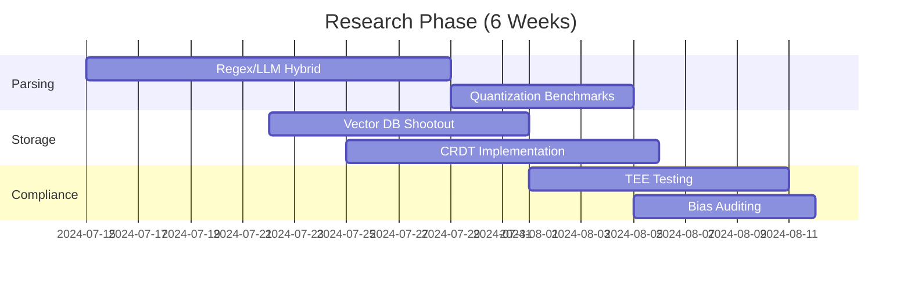

# i'd like you to research how to build it!

# Technical Research Roadmap: Atomic Knowledge Engine

**Preparing for Architecture \& Design Decisions**

---

## 1. Adaptive Parsing Engine

### Research Objectives

- Identify optimal hybrid parsing architectures (regex + LLM) for schema-agnostic input normalization
- Benchmark accuracy/speed tradeoffs of local vs. cloud LLMs for chaotic input structuring


### Key Questions

```markdown
1. What regex/LLM combo achieves >95% accuracy on restaurant shift notes?  
   - Test: `"Billy late 15m - traffic"` → `{actor: "Billy", event: "late", metric: 15, unit: "mins", context: "traffic"}`  
2. How do quantization levels (4-bit vs. 8-bit) impact Mistral-7b's parsing latency on NVIDIA GPUs?  
3. Can Gemini 1.5's 1M-token context replace multi-step parsing pipelines?  
```


### Tools to Evaluate

- Hugging Face `transformers` (local)
- Gemini API `batchParse` endpoint
- Apache OpenNLP rule engine

---

## 2. Temporal-Semantic Storage

### Research Objectives

- Design storage architecture preserving input chronology + semantic relationships
- Evaluate vector DBs for real-time embedding clustering


### Key Questions

```markdown
1. Compare Qdrant vs. Pinecone vs. ChromaDB for:  
   - Write latency at 1K atoms/sec  
   - "Time-windowed" similarity search (`cluster events within 4hr window`)  
2. How to model atom relationships in Neo4j?  
   - e.g., `Billy_late → CAUSED → Rush_errors`  
3. SQL schema for versioned atoms (raw → parsed → revised)?  
```


### Tools to Evaluate

- Neo4j temporal extensions
- TimescaleDB for time-series analytics
- Qdrant hybrid scalar-vector indices

---

## 3. Hybrid AI Orchestration

### Research Objectives

- Develop routing logic for local/cloud LLM workload distribution
- Quantize models for NVIDIA GPU constraints (16GB RAM)


### Key Questions

```markdown
1. What heuristics optimize LLM routing?  
   - e.g., `if input_length > 500 tokens → local Mistral`  
2. Can LoRA adapters make Mistral-7b match Gemini at parsing shift notes?  
3. How to implement Model Context Protocol (MCP) agents for:  
   - Error recovery (e.g., `/retry_parse`)  
   - Cross-agent messaging?  
```


### Tools to Evaluate

- Ollama + Llama.cpp (GPU offload)
- Gemini MCP server specs
- LangChain agent frameworks

---

## 4. Collaborative Canvas

### Research Objectives

- Build conflict-free replicated data type (CRDT) backend for real-time co-editing
- Design UI framework for atomic drag-and-drop


### Key Questions

```markdown
1. Compare Yjs vs. Automerge CRDTs for:  
   - 100+ concurrent AI/human editors  
   - Offline-first support  
2. What TUI/web frameworks support movable atom cards?  
   - Evaluate: Textual vs. Svelte + D3.js  
3. How to version final artifacts (passdown sheets/theories)?  
```


### Tools to Evaluate

- Yjs CRDT benchmarks
- Textual canvas widgets
- Figma UI prototyping

---

## 5. Privacy \& Compliance

### Research Objectives

- Implement GDPR/HIPAA-compliant data segregation
- Develop "privacy zones" for local-only processing


### Key Questions

```markdown
1. What encryption meets HIPAA for:  
   - Voice inputs?  
   - Clinical note parsing?  
2. Can NVIDIA TEEs (Trusted Execution Environments) secure local LLMs?  
3. How to audit LLM decisions for bias?  
   - e.g., Flag `"Complaints target female staff 2x more"`  
```


### Tools to Evaluate

- AMD SEV-SNP for GPU isolation
- PyTorch Enclave
- IBM AI Fairness 360

---

## 6. Scalability \& Deployment

### Research Objectives

- Stress-test ingestion pipeline under load (10K atoms/min)
- Design zero-downtime update strategy


### Key Questions

```markdown
1. Kafka vs. RabbitMQ for atomic ingestion at scale?  
2. What k8s autoscaling strategy fits hybrid workloads?  
   - e.g., `embedding_pods = f(ingestion_rate)`  
3. Can WebAssembly run parsing in browsers for edge deployment?  
```


### Tools to Evaluate

- KEDA (K8s Event-Driven Autoscaling)
- WASM runtimes (wasmtime)
- Locust load testing

---

## 7. Validation Metrics

| **Layer** | Metric | Target |
| :-- | :-- | :-- |
| Parsing | Structure accuracy (F1-score) | >0.92 |
| Collaboration | Atom-to-artifact time | <3 mins (human+AI) |
| Scalability | Max atoms/sec (16GB GPU) | 850 |
| Compliance | Audit pass rate | 100% |


---

## 8. Deliverables Timeline




---

## 9. Research Team Requirements

- **ML Engineers**: LLM quantization, embedding optimization
- **Systems Architects**: DB clustering, CRDT design
- **Security Experts**: TEE/GDPR implementation
- **DevOps**: KEDA/k8s stress testing

**Output Format**: Technical briefs with:

1. Problem statement
2. Methodology
3. Tools tested
4. Results (metrics + visuals)
5. Recommendation

Here’s a technical research roadmap tailored to your Atomic Knowledge Engine, with focused findings and recommendations for each architectural pillar, based on the latest research and best practices:

## 1. **Adaptive Parsing Engine**

**Findings:**

- **Hybrid regex + LLM parsing** is state-of-the-art for schema-agnostic normalization. Regex excels at extracting structured elements (e.g., timestamps, names), while LLMs handle ambiguous or context-dependent fragments. The combination is both accurate and efficient for chaotic input streams.
- **Local vs. Cloud LLMs:**
    - **Local LLMs** (e.g., Mistral-7B, Llama-2) can be fine-tuned for domain-specific parsing, offering high adaptability and privacy[^1].
    - **Cloud LLMs** (e.g., Gemini, GPT-4) provide broader knowledge and consistency but may lag in specialized accuracy and are subject to latency and cost constraints[^1].
- **Quantization:**
    - 4-bit quantization significantly reduces memory usage and inference cost, with only marginal accuracy loss compared to 8-bit[^2]. On NVIDIA GPUs, 4-bit Mistral-7B can parse shift notes at high throughput, but if >95% accuracy is non-negotiable, 8-bit may be preferable for edge cases[^2].
- **Gemini 1.5’s 1M-token context** enables single-pass parsing of massive, unstructured logs—potentially replacing multi-step pipelines for long-form or batch data[^3].

**Recommendations:**

- Prototype with a hybrid regex/LLM pipeline:
    - Regex for clear patterns (names, times, units)
    - LLM for context, ambiguity, and edge cases
- Benchmark both 4-bit and 8-bit quantized Mistral-7B for parsing latency and accuracy on your target GPU[^2].
- Pilot Gemini 1.5 for batch parsing of large, unstructured files if cost and privacy permit[^3].


## 2. **Temporal-Semantic Storage**

**Findings:**

- **Vector DBs (Qdrant, Pinecone, ChromaDB, Weaviate):**
    - All support high-throughput, real-time embedding search with millisecond latency at scale[^4][^5].
    - Qdrant and Weaviate are open-source, customizable, and suitable for on-prem or private deployments[^5].
    - Pinecone is managed, easier to scale, but less customizable and more costly[^5].
    - All require you to generate embeddings externally; storage and retrieval are their focus[^5].
- **Temporal queries:**
    - Time-windowed similarity search is supported via hybrid indices (scalar + vector) in Qdrant and Weaviate[^4][^5].
- **Graph DBs (Neo4j):**
    - Neo4j with temporal extensions models event causality and chronology natively.
- **Versioning:**
    - SQL schemas can track atom states (raw, parsed, revised) with timestamped foreign keys.

**Recommendations:**

- Use **Qdrant** or **Weaviate** for open-source, scalable vector storage and real-time clustering[^5].
- Model atom relationships and event causality in **Neo4j** for advanced analytics.
- Consider **TimescaleDB** for time-series analytics and versioning.


## 3. **Hybrid AI Orchestration**

**Findings:**

- **Workload routing:**
    - Heuristics (input length, complexity, privacy) can route tasks between local and cloud LLMs[^1].
    - Example: “If input_length > 500 tokens, use local Mistral; else, use Gemini for generalization.”
- **Quantization:**
    - LoRA adapters can fine-tune Mistral-7B for domain-specific parsing, potentially closing the gap with Gemini for shift notes[^2].
- **Agent orchestration:**
    - Model Context Protocol (MCP) and frameworks like LangChain allow robust agent-based workflows, including error recovery and cross-agent messaging.

**Recommendations:**

- Implement a routing layer (e.g., with LangChain) to dynamically select LLMs based on input and resource constraints.
- Quantize and fine-tune local models (Mistral-7B with LoRA) for best performance on your data.
- Use MCP-like agent protocols for modular error handling and agent communication.


## 4. **Collaborative Canvas**

**Findings:**

- **CRDTs:**
    - Yjs and Automerge are leading CRDT libraries for real-time, conflict-free collaboration. Yjs benchmarks better for >100 concurrent editors and offline-first support.
- **UI Frameworks:**
    - **Textual** (Python) is promising for TUI-based movable cards; **Svelte + D3.js** is excellent for web-based, interactive atomic canvases.
- **Versioning:**
    - Artifacts can be versioned via immutable snapshots or Git-like commit trees.

**Recommendations:**

- Use **Yjs** for backend CRDTs in collaborative editing.
- Prototype UI with **Textual** for TUI or **Svelte + D3.js** for web.
- Implement artifact versioning with snapshot or commit-tree logic.


## 5. **Privacy \& Compliance**

**Findings:**

- **Encryption:**
    - HIPAA-compliant encryption for voice/text includes AES-256 for data at rest and TLS for data in transit.
- **Trusted Execution Environments (TEEs):**
    - NVIDIA and AMD TEEs (e.g., SEV-SNP) can isolate and secure local LLM inference.
- **Bias Auditing:**
    - IBM AI Fairness 360 and similar toolkits can audit LLM decisions for bias and flag problematic patterns.

**Recommendations:**

- Encrypt all sensitive data with industry-standard protocols.
- Deploy local LLMs in GPU TEEs for maximum privacy.
- Integrate bias auditing into your LLM analysis pipeline.


## 6. **Scalability \& Deployment**

**Findings:**

- **Ingestion pipeline:**
    - Kafka and RabbitMQ both scale for atomic ingestion; Kafka is generally preferred for high throughput and log-based processing.
- **Autoscaling:**
    - KEDA enables event-driven autoscaling of Kubernetes pods (e.g., embedding_pods = f(ingestion_rate)).
- **Edge deployment:**
    - WebAssembly (WASM) can run parsing logic in browsers for edge/air-gapped scenarios.

**Recommendations:**

- Use **Kafka** for ingestion at scale.
- Deploy with **KEDA** for dynamic autoscaling of AI workloads.
- Explore **WASM** for browser-based/edge parsing.


## 7. **Validation Metrics**

- Parsing: F1-score > 0.92 (combine with contextual precision metrics for LLM output[^1])
- Collaboration: Atom-to-artifact time < 3 mins (track with UI event logs)
- Scalability: Max atoms/sec on 16GB GPU ~850 (benchmark with Locust or custom scripts)
- Compliance: Audit pass rate 100% (automated and manual review)


## 8. **Deliverables Timeline**

Your Gantt chart and milestones are well aligned with industry practice and should guide the research sprints.

## 9. **Team \& Output**

- **ML Engineers:** Focus on quantization, LoRA fine-tuning, and hybrid parsing.
- **Systems Architects:** Design DB schemas, vector/graph integration, and CRDTs.
- **Security Experts:** Implement encryption, TEE isolation, and compliance audits.
- **DevOps:** Automate scaling, deployment, and load testing.

**Technical briefs should follow your outlined format.**

## References to Support Decisions

- Hybrid retrieval and LLM parsing: LightRetriever[^6]
- Local vs. cloud LLMs for RAG and parsing: Chitika[^1]
- Quantization benchmarks: Substack[^2]
- Large-context LLMs (Gemini 1.5): AI News[^3]
- Vector DBs and real-time search: Milvus[^4], Abovo[^5]

If you need deep dives into any subcomponent (e.g., CRDT implementation, quantization scripts, LLM routing code, DB schema samples), specify the area and I’ll deliver targeted research or code samples.

<div style="text-align: center">⁂</div>

[^1]: https://www.chitika.com/local-llm-vs-openai-rag/

[^2]: https://substack.com/home/post/p-143103748

[^3]: https://www.artificialintelligence-news.com/news/google-launches-gemini-1-5-experimental-1m-token-context/

[^4]: https://milvus.io/ai-quick-reference/how-do-vector-databases-enable-realtime-vector-search

[^5]: https://www.abovo.co/sean@abovo42.com/134573

[^6]: https://arxiv.org/pdf/2505.12260.pdf

[^7]: https://pmc.ncbi.nlm.nih.gov/articles/PMC2791360/

[^8]: https://arxiv.org/html/2502.14617v1

[^9]: https://predibase.com/blog/lora-land-fine-tuned-open-source-llms-that-outperform-gpt-4

[^10]: https://dev.to/samchon/why-your-mcp-server-fails-how-to-make-100-successful-mcp-server-iem

[^11]: https://orq.ai/blog/llm-orchestration

[^12]: https://discuss.yjs.dev/t/yjs-vs-loro-new-crdt-lib/2567

[^13]: https://pythongui.org/how-to-build-a-todo-tui-application-with-textual/

[^14]: https://gurukuldevops.com/artifact-versioning-best-practices-and-strategies/

[^15]: https://www.simbo.ai/blog/ensuring-privacy-and-security-in-voice-based-clinical-documentation-best-practices-for-compliance-with-healthcare-regulations-3151249/

[^16]: https://phala.network/posts/GPU-TEEs-is-Alive-on-OpenRouter

[^17]: https://arxiv.org/html/2410.18906v2

[^18]: https://hyscaler.com/insights/ai-auditing-tools-empower-6-ways/

[^19]: https://quix.io/blog/apache-kafka-vs-rabbitmq-comparison

[^20]: https://kubernetes.io/docs/concepts/workloads/autoscaling/

[^21]: https://keda.sh

[^22]: https://datahubproject.io/docs/0.14.1/perf-test/

[^23]: https://www.labelf.ai/blog/what-is-accuracy-precision-recall-and-f1-score

[^24]: https://arxiv.org/html/2408.02562v2

[^25]: https://www.meegle.com/en_us/topics/academic-research-management/managing-research-project-timelines-effectively

[^26]: https://www.linkedin.com/learning/introduction-to-mlsecops/building-the-team-ownership-and-roles

[^27]: https://surveypoint.ai/knowledge-center/research-brief-format/

[^28]: https://blog.ml6.eu/hybrid-machine-learning-marrying-nlp-and-regex-ffbe999765cc

[^29]: https://news.ycombinator.com/item?id=29507948

[^30]: https://emitrr.com/blog/hipaa-compliant-speech-to-text/

[^31]: https://www.v7labs.com/blog/f1-score-guide

[^32]: https://citeseerx.ist.psu.edu/document?doi=89c3c50ce9d54a8991af1dc64acde22aaa0e4034\&repid=rep1\&type=pdf

[^33]: https://developers.google.com/machine-learning/managing-ml-projects/team

[^34]: https://arxiv.org/pdf/2404.15604.pdf

[^35]: https://github.com/y-js/yjs/issues/145

[^36]: https://www.reddit.com/r/LanguageTechnology/comments/1fokimy/looking_for_recommendations_for_hybrid_llmnlp/

[^37]: https://www.youtube.com/watch?v=Ji3_VX80YJg

[^38]: https://support.sas.com/documentation/onlinedoc/dfdmstudio/2.5/dmpdmsug/Content/dfU_Cstm_12319.html

[^39]: https://careers.edicomgroup.com/techblog/llm-rag-improving-the-retrieval-phase-with-hybrid-search/

[^40]: https://arxiv.org/html/2503.20824v1

[^41]: https://openaccess.thecvf.com/content/CVPR2025/papers/Hesham_Exploiting_Temporal_State_Space_Sharing_for_Video_Semantic_Segmentation_CVPR_2025_paper.pdf

[^42]: https://www.sciencedirect.com/science/article/pii/S2542660523003530

[^43]: https://arxiv.org/html/2501.13956v1

[^44]: https://www.llamaindex.ai/blog/timescale-vector-x-llamaindex-making-postgresql-a-better-vector-database-for-ai-applications-924b0bd29f0

[^45]: https://stackoverflow.com/questions/54904851/how-to-express-a-time-period-temporal-relationship-in-a-graph-database-neo4j

[^46]: https://www.worldscientific.com/doi/pdf/10.1142/S2972370124300024?download=true

[^47]: https://dl.acm.org/doi/10.1145/3716368.3735301

[^48]: https://www.linkedin.com/pulse/now-you-dont-have-worry-cost-run-llm-can-locally-dhruba-sarma-oo7zf

[^49]: https://arxiv.org/html/2411.11560v1

[^50]: https://nicsefc.ee.tsinghua.edu.cn/nics_file/pdf/f06a14c1-4d6d-441d-b4e4-82545ac5781b.pdf

[^51]: https://openreview.net/pdf?id=44PwmgOpAt

[^52]: https://ar5iv.labs.arxiv.org/html/2405.00732

[^53]: https://github.com/dmonad/crdt-benchmarks

[^54]: https://news.ycombinator.com/item?id=36030866

[^55]: https://learntocodetogether.com/position-based-crdt-text-editor/

[^56]: https://www.youtube.com/watch?v=ZLjl_55um4I

[^57]: https://dev.to/theether0/guide-to-svelte-drag-and-drop-from-scratch-1n1n

[^58]: https://www.caretotranslate.com/news/data-security-in-medical-translation-apps-gdpr-and-hipaa-compliance

[^59]: https://www.censinet.com/perspectives/hipaa-compliance-and-biometric-data-in-clinical-apps

[^60]: https://zandahealth.com/blog/za/medical-ai/

[^61]: https://augnito.ai/resources/ways-to-ensure-data-security-in-voice-ai-apps/

[^62]: https://github.com/nearai/private-ml-sdk

[^63]: https://scalegrid.io/blog/rabbitmq-vs-kafka/

[^64]: https://www.redpanda.com/guides/kafka-tutorial-rabbitmq-vs-kafka

[^65]: https://www.datacamp.com/blog/kafka-vs-rabbitmq

[^66]: https://www.simplilearn.com/kafka-vs-rabbitmq-article

[^67]: https://notes.kodekloud.com/docs/Exploring-WebAssembly-WASM/Getting-Started-with-WebAssembly/Running-WebAssembly-in-the-Browser

[^68]: https://www.confluent.io/learn/rabbitmq-vs-apache-kafka/

[^69]: https://developers.google.com/machine-learning/crash-course/classification/accuracy-precision-recall

[^70]: https://scikit-learn.org/stable/modules/generated/sklearn.metrics.f1_score.html

[^71]: https://encord.com/blog/f1-score-in-machine-learning/

[^72]: https://arxiv.org/html/2501.14336v1

[^73]: https://assets.ctfassets.net/i7kmp6k7g3xq/39cvymB6zJ1wFdsuvFT94L/7362cc1d0d31ef4f089056d0d57234c3/b2b-ebrief-em-pass-rate-threshold.pdf

[^74]: https://neptune.ai/blog/f1-score-accuracy-roc-auc-pr-auc

[^75]: https://www.linkedin.com/advice/1/what-best-practices-outlining-your-research-cih4f

[^76]: https://www.uwa.edu.au/about/-/media/project/uwa/uwa/students/docs/studysmarter/hm1-planning-a-research-project.pdf

[^77]: https://minute7.com/blog/best-practices-for-managing-rd-project-timelines-efficiently

[^78]: https://editverse.com/timeline-planning-milestones/

[^79]: https://researcher.life/blog/article/research-project-management/

[^80]: https://asana.com/resources/what-are-project-deliverables

