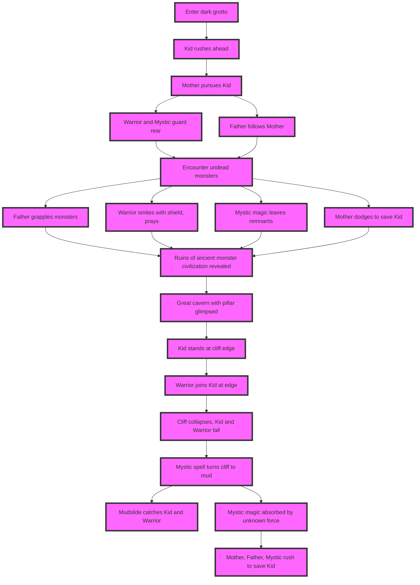

A group enters a dark grotto stinking of dead plant life. Always curious Kid goes first, who is small and light and couldn't be held back anyway. 

Following behind is the self-appointed foster Mother, trying to keep up, and self-appointed foster Father close behind her. 
Warrior and Mystic, shield and thought, leisurely chat and take up the rear. Behind them is the acrobatic monkey Bonglebun. 
In the inner chambers they see some old corpses of unnatural monsters that aren't in a state of unsightly decay, and push further on to come across some that are still alive in some sort of already-dead-and-body-broken-but-still-painfully-there. Worse, some fully alive and in a defensive frenzy.
Quickly their attention is just barely stimulated by the entrance of the small presence of Kid, and come to awareness of the intruder with proximity. 
Their attention quickly would transfer to Mother though, who elegantly dodges highly dangerous attacks with a low level of seriousness and never wavers in her task of recovering Kid. 
Father follows suit and takes opportunities to seize natural monsters by surprise and grapple them to submission, giving the swift snap of the neck. 
Similarly precise, practiced and dignified, Warrior puts them down with a powerful but effortless frontal shield crash - breaking out the natural monster's energies into the air as a sort of misty avatar - to which he says a prayer and then breaks the organizing edge tension. That portion of misty remnants which remained after the Warrior's dissipation, gravitates to Mystic with some wispy visuals clinging to the hip, hand, ankle, collarbone, hair.

The grotto starts to open up and show signs of a greater buried natural monster civilization, but also some larger scale intense underground features, such as a great cliff and cavern, and somehow a great pillar running through it, How large and clean and scenic; what contrast!

Kid reaches the edge of the cliff and stands there, does over the edge, arms spread wide and gasping for air. Oh, how innocent youth take in the world so thoroughly. It seems Warrior recognizes the architecture vaguely, and Mystic remarks that it is from a very early time.
Mother wants Kid away from the edge, while Warrior walks up firmly next to him. He takes the last step, they stand together on the edge, a tiny rock trickles down from between their feet, Warrior looks down proudly at Kid, puts his hand on his shoulder with just the slightest pat, but not without weight, and the cliff breaks cleanly and the two fall into the abyss.

Mother just gasps, and Father is rushing to the edge. Mystic is quick to cast a spell and turn the whole cliff edge which is supporting them to slipping wet mud. Roots and rocks and debris are uncovered, and the landslide drops everything down.

The flow quickly stops in a lurching halt as the still solid part of the mudslide smash together in a graceless beaver dam or birds nest.

The beauty can be found in the function, though: With a branch sticking out over the abyss, fastened between two stacked rock rubble, Warrior dangles, pinned through the back of his cargo-shorts, head and arms and legs free, like a book closed over a taught string.

And young Kid was clasped between his legs, in almost fearful awe but then giggling and looking at Warrior appreciatively. Some other parts of the terrain are beginning to slide, and revealing what is underneath. 
Mystic casually stopped the flow of magic but as he is starting to realize there is something that has absorbed it and is continuing to propagate it outside of the resources from his mana pool. This is surely alarming to him, but he is trying to keep calm and just follow Father, who is following Mother, who is frantically trying to get to Kid.

